# DevOps Project 3 – Use Ansible for App Deployment

## What is Infrastructure as Code (IaC)?

- IAC is the practice of managing and provisioning resources and infrastructure using code instead of manual processes.

## Benefits of IaC?

- Automation - Infrastructure can be deployed and managed automatically, reducing manual input.
- Consistency - Ensures the same configuration each time you want to deploy resources using the same scripts.
- Speed - faster provisioning and updates of infrastructure.
- Scalability - Easily scale infrastructure up or down using templates.
- Disaster recovery - quickly recreate infrastructure from code in case of failures.

## When/where to use IaC

- Managing cloud infrastructure (AWS, Azure, GCP)
- Operating in multi-environment setups (dev/test/prod)
- Scaling microservices and containerized workloads
- Deploying frequently and needing agility
- Requiring compliance and auditability of infrastructure changes

**Industries Using IaC:**
- Cloud-native companies
- Enterprises moving to the cloud
- DevOps teams and CI/CD pipelines
- Startups aiming for rapid growth

## What are the tools available for IaC?

### Provisioning (Defining and creating infrastructure)

- Terraform
- CloudFormation
- Pulumi 

### Configuration Management (Managing software/configurations on existing infrastructure)

- Ansible
- Chef
- Puppet
- SaltStack

## What is configuration management (CM)?

Configuration Management (CM) refers to the process of managing and maintaining the desired state of software, systems, and infrastructure. This includes:

- Installing and updating software packages.
- Applying configurations (security policies, network settings, application parameters).
- Managing files and services.
- Enforcing compliance across multiple servers.


## What is provisioning of infrastructure? Do CM tools do it?

Provisioning typically happens before configuration management. Examples include:

- Spinning up EC2 instances.
- Creating VPCs and subnets.
- Allocating storage volumes.
- Configuring DNS entries.

CM tools like ansible, chef and puppet focus on configuring existing infrastructure rather than creating new infrastructure. 
- However, some tools like ansible can do both - although its most commonly used for configuration management. 

## What is Ansible and how does it work?

- Ansible is an open-source automation tool used for configuration management, application deployment, and infrastructure automation. 
- It is agentless (meaning no software needs to be installed on target systems).

### How Ansible works:

1. Define playbooks - Playbooks= define the tasks and config to apply to the servers.
2. Use inventory - lists the servers to manage (Ips, hostnames, groups).
3. Execute via SSH - Ansible connects to target servers over SSH.
4. Apply desired state - ensures servers match the defined configurations

### Key Ansible Features
- Agentless: No agent required on managed nodes.
- Declarative and Imperative: Can enforce a desired state or run step-by-step tasks.
- Idempotent: Ensures changes only happen when necessary.
- Extensible: Large library of modules for different tasks (AWS, Azure, Docker, Kubernetes, etc.).


## Who is using IaC and Ansible in the industry

**Industries and Companies Using IaC**
- Tech giants: Netflix, Google, Microsoft
- Financial Services: JPMorgan Chase, Capital One
- E-commerce: Amazon, Etsy
- Telecom: Verizon, AT&T
- Government: US Department of Defense, NASA
- Startups: Most cloud-native startups use IaC by default.


# Ansible setup 


1. Create EC2 instances for Ansible controller and first target node
   - ANSIBLE VM:
     - Name - tech501-zainab-ubuntu-2204-ansible-controller
     - Image - ubuntu 22.04 LTS
     - Size - t3.micro
     - Key pair - usual one you previously created
     - Security group - Allow SSH
  
   - TARGET VM (App):
     - Name  - tech501-zainab-ubuntu-2204-ansible-target-node-app
     - Image - ubuntu 22.04 (LTS)
     - Size - t3.micro
     - Security group - Allow SSH, HTTP, 3000
     - Key pair - usual.

Make sure SSH for both VM's works. 
- `$ ssh -i ~/.ssh/aws-key-zainab.pem  ubuntu@54.229.138.82`

2. Setup dependencies for the ansible controller and app vm (target node)
   - **Install ansible on the controller vm:**
    ```
    sudo apt update
    sudo apt install software-properties-common
    sudo add-apt-repository --yes --update ppa:ansible/ansible
    sudo apt install ansible
    ```


   - `ls -a` should also show a .ansible folder.
  


   - **Setup the SSH private key to access your target node:**
     - save the private key in the .ssh folder in the controller vm 
     - Use scp command - on local machine where you're copying from!
     - `scp -i /c/Users/zaina/.ssh/aws-key-zainab.pem /c/Users/zaina/.ssh/aws-key-zainab.pem ubuntu@3.253.103.169:/home/ubuntu/`
     - This command uses -i flag to use private key to aunthenticate the copying. 
  
  

     - Then use mv command in the controller vm to move the private key to the .ssh folder:
       - `mv /home/ubuntu/aws-key-zainab.pem /home/ubuntu/.ssh`
     - Then set the read only permissions to owner for the key:
       - `chmod 400 /home/ubuntu/.ssh/aws-key-zainab.pem`

   - SSH into the target node from the controller vm:
     -  `ssh -i ~/.ssh/aws-key-zainab.pem ubuntu@34.244.103.9`

Separate git bash window - ssh back into the controller vm 
**- Setup the folder structure for ansible:**
  - Create an ansible folder - `mkdir ansible`
  - `cd ansible`
  - `touch ansible.cfg hosts` - creates 2 files.
  - `mkdir roles` - creates a roles folder. 
  - Install tree to see the structure better - `sudo apt install tree`
  - In the ansible.cfg file: `nano ansible.cfg`

```
[defaults]
inventory = hosts
remote_user = ubuntu
private_key_file = /home/ubuntu/.ssh/aws-key-zainab.pem
host_key_checking = False

```
  
- In the hosts file: Target node public IP. 

```
[web]
3.253.103.169
```
If an error is encountered: 

```
[app] # this is just a tag to organise the servers to use for the pings later. E.g. having app servers and then web servers seperately. 
ec2-instance-app ansible_host=34.244.103.9 ansible_user=ubuntu ansible_ssh_private_key_file=/home/ubuntu/aws-key-zainab.pem

```

- `tree`
- To check your ansible configuration works properly - in the ansible folder - `ansible all -m ping` - pings target nodes. 


- To only target the web servers: `ansible web -m ping`
  - Need to have a web section in the hosts file for this

- Receiving a python interpreter warning when i run the ping command - how to get rid of it:
  - Go to the link given in the warning
  - https://docs.ansible.com/ansible-
    core/2.17/reference_appendices/interpreter_discovery.html 
  - Add python interpreter line to the ansible.cfg file:
  - `interpreter_python = /usr/bin/python3`
  - Config file should look like this:
  ```
  [defaults]
  inventory = hosts
  remote_user = ubuntu
  private_key_file = /home/ubuntu/.ssh/aws-key-zainab.pem
  host_key_checking = False
  interpreter_python = /usr/bin/python3

  ```

- Warning should disappear.


## Ad hoc commands:

- **Ad hoc** = one off/one-time commands without using a playbook, directly from the terminal. 
- `ansible all -m ping` - runs the ping module on all servers in the web group - built in module that checks if ansible can connect to a server.
  - This is an ad hoc command because it's run from the terminal and no playbook file is needed.
  - If no module is used, the default module will be used - `command` module. 
  - Advantages of command module
    - simple, just runs the command you type.
    - Works on almost any system
    - Good for quick fixes or system commands.
  - Disadvantages:
    - It's not idempotent - ansible has no way of knowing if the command already ran or needs to run again.
    - It doesn’t support things like pipes, redirection, or environment variables.
    - Less "Ansible-friendly" than purpose-built modules like apt, yum, file, etc.

- `ansible web -a "cat /etc/os-release"` - This uses the default command module to run `cat /etc/os-release` on all machines in the hosts file. If you want, can specify different groups like [web] or [app] instead of all. (need to add them to hosts file).
- 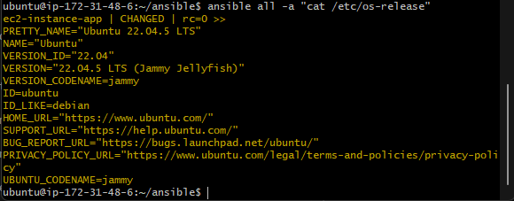

- `ansible web -a "date"` - runs the date command. 
- -a means "run this command"

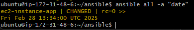

These commands ran on my target node through the ansible controller. 

## Update command - 3 methods:

1. Command module - `ansible app -b -m command -a "apt update"`
2. Shell module - `ansible app -b -m shell -a "apt update && apt upgrade -y"`
3. Apt module - `ansible app -b -m apt -a "update_cache=yes upgrade=dist"`
  - Idempotent - only upgrades if necessary. 
  - Recommended practice. 

## Using an ad hoc command to copy my private key from the controller vm to the target vm:

`ansible app -b -m copy -a "src=/home/ubuntu/.ssh/aws-key-zainab.pem dest=/home/ubuntu/.ssh owner=ubuntu group=ubuntu mode=0600"`

## Creating playbooks:

- `git clone https://github.com/zainabx78/tech501-sparta-app repo`
- In ansible folder - create file called install_nginx.yml
- Run this file using `ansible-playbook -i hosts install_nginx.yml`

```
---
- name: install nginx play
  hosts: app
  gather_facts: yes  # Get comprehensive facts about the hosts
  become: yes        # Gain admin (sudo) access

  tasks:
    - name: Update apt cache
      apt:
        update_cache: yes

    - name: Upgrade all packages
      apt:
        upgrade: dist

    - name: Install and configure nginx
      apt:
        name: nginx
        state: present

  ```
- Another file called prov_app_with_npm_start.yml
- Run using `ansible-playbook -i hosts prov_app_with_npm_start.yml`


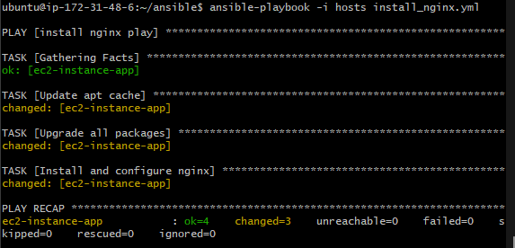

```
---

- name: Install Node.js, Clone App from GitHub, and Start App
  hosts: all  # You can specify a particular group of hosts if needed
  become: true  # Run tasks with sudo privileges

  tasks:

    - name: Remove all conflicting Node.js-related packages
      ansible.builtin.apt:
        name:
          - nodejs
          - libnode72
          - libnode-dev
          - npm
        state: absent
        purge: true


    - name: Remove libnode-dev if installed (to avoid conflicts)
      ansible.builtin.apt:
        name: libnode-dev
        purge: true
        state: absent  # Ensure libnode-dev is removed


    - name: Remove the old version of Node.js (if installed)
      ansible.builtin.apt:
        name: nodejs
        purge: yes
        state: absent  # Remove existing version


    - name: Remove npm
      ansible.builtin.apt:
        name: npm
        purge: yes
        state: absent

    - name: Add NodeSource repository for Node.js 20.x
      ansible.builtin.shell: |
        curl -fsSL https://deb.nodesource.com/setup_20.x | bash -
      args:
        creates: /etc/apt/sources.list.d/nodesource.list  # Only run if the NodeSource repo isn't already added

    - name: Install Node.js
      ansible.builtin.apt:
        name: nodejs
        state: present  # Ensure Node.js is installed

    - name: Clone the app from GitHub
      ansible.builtin.git:
        repo: 'https://github.com/zainabx78/tech501-sparta-app-cicd.git' # Replace with your GitHub repo URL
        dest: /repo  # Destination folder on the target machine
        clone: yes
        update: yes
        version: main  # You can specify a different branch if necessary

    - name: Run npm install in the app directory
      ansible.builtin.command:
        cmd: npm install
        chdir: /repo/app  # Path to the app directory
        creates: /repo/app/node_modules  # Prevent running npm install again if node_modules exists

    - name: Start the app using npm start
      ansible.builtin.command:
        cmd: npm start
        chdir: /repo/app  # Path to the app directory
        creates: /repo/app/app.pid  # You can specify a file that gets created when the app starts, to avoid running npm start multiple times

```

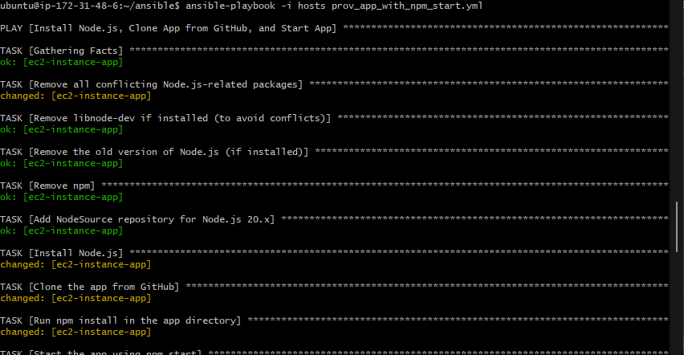

App should now run on port 3000:

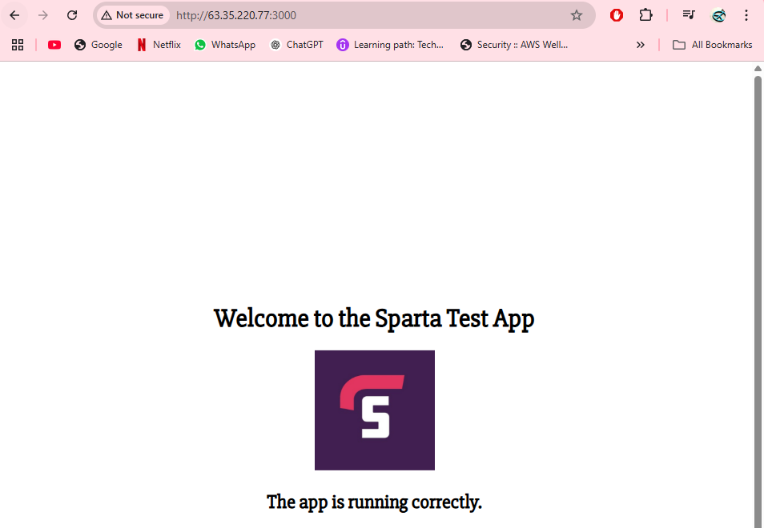

Blocker - node package was already there so had some clashes, needed to purge and remove all packages at the start of the script and then it worked.


## Running the app with pm2 instead of npm start


```

---

- name: Install Node.js, Clone App from GitHub, and Start App
  hosts: all  # You can specify a particular group of hosts if needed
  become: true  # Run tasks with sudo privileges

  tasks:

    - name: Remove all conflicting Node.js-related packages
      ansible.builtin.apt:
        name:
          - nodejs
          - libnode72
          - libnode-dev
          - npm
        state: absent
        purge: true


    - name: Remove libnode-dev if installed (to avoid conflicts)
      ansible.builtin.apt:
        name: libnode-dev
        purge: true
        state: absent  # Ensure libnode-dev is removed


    - name: Remove the old version of Node.js (if installed)
      ansible.builtin.apt:
        name: nodejs
        purge: yes
        state: absent  # Remove existing version


    - name: Remove npm
      ansible.builtin.apt:
        name: npm
        purge: yes
        state: absent

    - name: Add NodeSource repository for Node.js 20.x
      ansible.builtin.shell: |
        curl -fsSL https://deb.nodesource.com/setup_20.x | bash -
      args:
        creates: /etc/apt/sources.list.d/nodesource.list  # Only run if the NodeSource repo isn't already added

    - name: Install Node.js
      ansible.builtin.apt:
        name: nodejs
        state: present  # Ensure Node.js is installed

    - name: Install pm2 globally
      ansible.builtin.npm:
        name: pm2
        global: true
        state: present

    - name: Clone the app from GitHub
      ansible.builtin.git:
        repo: 'https://github.com/zainabx78/tech501-sparta-app-cicd.git' # Replace with your GitHub repo URL
        dest: /repo  # Destination folder on the target machine
        clone: yes
        update: yes
        version: main  # You can specify a different branch if necessary

    - name: Run npm install in the app directory
      ansible.builtin.command:
        cmd: npm install
        chdir: /repo/app  # Path to the app directory
        creates: /repo/app/node_modules  # Prevent running npm install again if node_modules exists

    - name: Start app with pm2
      ansible.builtin.command:
        cmd: pm2 start app.js --name sparta-app
        chdir: /repo/app

```

## Create a db target vm:

Create an ec2 with name db:
- Same settings as usual, same key pair.
- Security group should allow ssh, db traffic (port 27017) and make sure you can ssh into the db vm from the controller. 

Add the db vm public IP to the hosts file on ansible controller. 

```
[app]
ec2-instance-app ansible_host=63.35.220.77 ansible_user=ubuntu ansible_ssh_private_key_file=/home/ubuntu/.ssh/aws-key-zainab.pem

[db]
ec2-instance-db ansible_host=34.245.60.116 ansible_user=ubuntu ansible_ssh_private_key_file=/home/ubuntu/.ssh/aws-key-zainab.pem

```
- Ping the 2 target vms with ansible:
  - `ansible all -m ping`


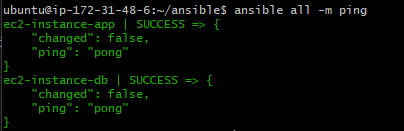

## Task: Create and run playbook to update and upgrade web and db groups of machines

### Create a new playbook:
- name: update_upgrade_all.yml
- This playbook will do apt upgrade and update to the app and db groups of the target nodes. 

```
- name: Update and upgrade web and db servers
  hosts: app:db
  become: true  # This allows Ansible to run the apt commands as root (via sudo)

  tasks:
    - name: Update apt package cache
      ansible.builtin.apt:
        update_cache: yes

    - name: Upgrade all packages to the latest version
      ansible.builtin.apt:
        upgrade: dist
```

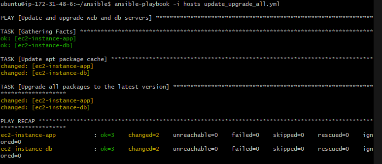


- You should not use command or shell for updates/upgrades because:

  - The apt module has built-in handling for retries, errors, and idempotency.
  - It integrates with Ansible’s become, handlers, and fact gathering.
  command and shell bypass much of this and are considered less Ansible-friendly (harder to maintain & extend).

- Why keep the updates and upgrades in a separate playbook:
  
  - Updates/upgrades are system maintenance, not application deployment. Mixing them adds complexity.
  - Updates/upgrades can break dependencies (e.g., a new Node.js version may break an app). Keeping them separate reduces risk.
  - If your deployment fails, you don’t want to guess whether it was because of a system update or an actual app bug.
  - Updates may require reboots or manual review (e.g., config file changes). Deployments should focus purely on application logic.

## Task: Create and run playbook to install Mongo DB

- Create a new playbook
- Name: install_mongodb.yml
- This playbook should get mongodb installed but not running.


```
---
- name: Install MongoDB 7.0.6 on DB hosts
  hosts: db  # Ensure this play runs only on hosts in the 'db' group
  become: true  # Run with sudo privileges

  tasks:

    - name: Uninstall any existing MongoDB packages
      ansible.builtin.apt:
        name:
          - mongodb-org
          - mongodb-org-database
          - mongodb-org-server
          - mongodb-mongosh
          - mongodb-org-mongos
          - mongodb-org-tools
        state: absent
        purge: yes  # Remove configuration files too
        autoremove: yes  # Automatically remove any dependencies that are no longer needed

    - name: Install necessary dependencies (gnupg and curl)
      ansible.builtin.apt:
        name:
          - gnupg
          - curl
        state: present
        update_cache: yes

    - name: Download MongoDB GPG key
      ansible.builtin.shell: |
        curl -fsSL https://www.mongodb.org/static/pgp/server-7.0.asc | \
        sudo gpg -o /usr/share/keyrings/mongodb-server-7.0.gpg --dearmor
      args:
        creates: /usr/share/keyrings/mongodb-server-7.0.gpg

    - name: Create MongoDB 7.0 repository list file
      ansible.builtin.shell: |
        echo "deb [ arch=amd64,arm64 signed-by=/usr/share/keyrings/mongodb-server-7.0.gpg ] https://repo.mongodb.org/apt/ubuntu jammy/mongodb-org/7.0 multiverse" | \
        sudo tee /etc/apt/sources.list.d/mongodb-org-7.0.list
      args:
        creates: /etc/apt/sources.list.d/mongodb-org-7.0.list

    - name: Update apt package list
      ansible.builtin.apt:
        update_cache: yes

    - name: Install MongoDB version 7.0.6
      ansible.builtin.apt:
        name:
          - mongodb-org=7.0.6
          - mongodb-org-database=7.0.6
          - mongodb-org-server=7.0.6
          - mongodb-mongosh
          - mongodb-org-mongos=7.0.6
          - mongodb-org-tools=7.0.6
        state: present
        update_cache: yes

    - name: Check MongoDB service status (before starting)
      ansible.builtin.systemd:
        name: mongod
        state: started
        enabled: yes
        daemon_reload: yes

    - name: Remove any existing net.bindIp section in mongod.conf
      ansible.builtin.replace:
        path: /etc/mongod.conf
        regexp: '(^net:\n(?:\s+.*\n)*)'
        replace: ''

    - name: Set bindIp to 0.0.0.0 in mongod.conf under net section
      ansible.builtin.blockinfile:
        path: /etc/mongod.conf
        marker: "# {mark} ANSIBLE MANAGED BLOCK"
        block: |
          net:
            bindIp: 0.0.0.0

    - name: Restart MongoDB service after bind IP change
      ansible.builtin.systemd:
        name: mongod
        state: restarted

    - name: Start and enable MongoDB
      service:
        name: mongod
        state: started
        enabled: true

    - name: Verify MongoDB is running
      ansible.builtin.systemd:
        name: mongod
        state: started
        enabled: yes

```

Blocker:


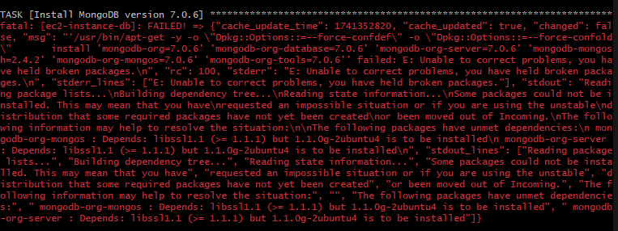

Fix: I took out the section in the playbook regarding holding package versions. 

Ensure the db is running through adhoc command in ansible controller:
- `ansible db -m shell -a "sudo systemctl status mongod"`


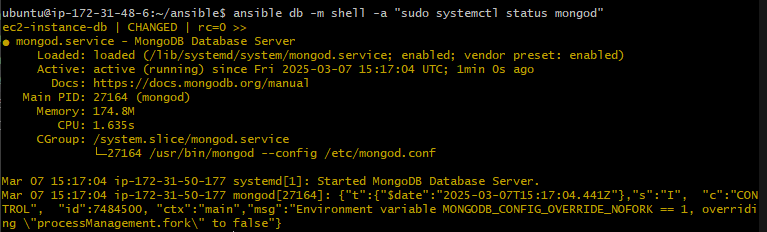

- Check bind ip:
  - `ansible db -m shell -a "grep bindIp /etc/mongod.conf"`


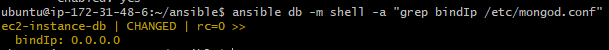

## Task: Create and run playbooks to provision the app and database:

- **Running the app with nginx reverse proxy:**

```
---

- name: Install Node.js, Clone App from GitHub, and Start App
  hosts: app  # You can specify a particular group of hosts if needed
  become: true  # Run tasks with sudo privileges

  tasks:

    - name: Remove all conflicting Node.js-related packages
      ansible.builtin.apt:
        name:
          - nodejs
          - libnode72
          - libnode-dev
          - npm
        state: absent
        purge: true


    - name: Remove libnode-dev if installed (to avoid conflicts)
      ansible.builtin.apt:
        name: libnode-dev
        purge: true
        state: absent  # Ensure libnode-dev is removed


    - name: Remove the old version of Node.js (if installed)
      ansible.builtin.apt:
        name: nodejs
        purge: yes
        state: absent  # Remove existing version


    - name: Remove npm
      ansible.builtin.apt:
        name: npm
        purge: yes
        state: absent

    - name: Add NodeSource repository for Node.js 20.x
      ansible.builtin.shell: |
        curl -fsSL https://deb.nodesource.com/setup_20.x | bash -
      args:
        creates: /etc/apt/sources.list.d/nodesource.list  # Only run if the NodeSource repo isn't already added

    - name: Install Node.js
      ansible.builtin.apt:
        name: nodejs
        state: present  # Ensure Node.js is installed

    - name: Clone the app from GitHub
      ansible.builtin.git:
        repo: 'https://github.com/zainabx78/tech501-sparta-app-cicd.git' # Replace with your GitHub repo URL
        dest: /repo  # Destination folder on the target machine
        clone: yes
        update: yes
        version: main  # You can specify a different branch if necessary

    - name: Configure nginx as reverse proxy
      copy:
        dest: /etc/nginx/sites-available/default
        content: |
          server {
              listen 80;
              server_name _;

              location / {
                  proxy_pass http://localhost:3000/;
                  proxy_set_header Host $host;
                  proxy_set_header X-Real-IP $remote_addr;
              }
          }
      notify: Restart nginx

    - name: Enable nginx and start
      service:
        name: nginx
        state: started
        enabled: yes

  handlers:
    - name: Restart nginx
      service:
        name: nginx
        state: restarted

    - name: Run npm install in the app directory
      ansible.builtin.command:
        cmd: npm install
        chdir: /repo/app  # Path to the app directory
        creates: /repo/app/node_modules  # Prevent running npm install again if node_modules exists

    - name: Start the app using npm start
      ansible.builtin.command:
        cmd: npm start
        chdir: /repo/app  # Path to the app directory
        creates: /repo/app/app.pid  # You can specify a file that gets created when the app starts, to avoid running npm start multiple times

```

- Creating a new playbook for everything to run app and db together:
  - Name: prov-app-all.yml
  - one playbook with 2 plays: 
    - 1 to configure app
    - 1 to configure db. 

```
---

- name: Configure and provision the database on DB hosts
  hosts: db
  become: true  # Ensure tasks run with sudo privileges

  tasks:
    - name: Uninstall any existing MongoDB packages
      ansible.builtin.apt:
        name:
          - mongodb-org
          - mongodb-org-database
          - mongodb-org-server
          - mongodb-mongosh
          - mongodb-org-mongos
          - mongodb-org-tools
        state: absent
        purge: yes  # Remove configuration files too
        autoremove: yes  # Automatically remove any dependencies that are no longer needed

    - name: Install necessary dependencies (gnupg and curl)
      ansible.builtin.apt:
        name:
          - gnupg
          - curl
        state: present
        update_cache: yes

    - name: Download MongoDB GPG key
      ansible.builtin.shell: |
        curl -fsSL https://www.mongodb.org/static/pgp/server-7.0.asc | \
        sudo gpg -o /usr/share/keyrings/mongodb-server-7.0.gpg --dearmor
      args:
        creates: /usr/share/keyrings/mongodb-server-7.0.gpg

    - name: Create MongoDB 7.0 repository list file
      ansible.builtin.shell: |
        echo "deb [ arch=amd64,arm64 signed-by=/usr/share/keyrings/mongodb-server-7.0.gpg ] https://repo.mongodb.org/apt/ubuntu jammy/mongodb-org/7.0 multiverse" | \
        sudo tee /etc/apt/sources.list.d/mongodb-org-7.0.list
      args:
        creates: /etc/apt/sources.list.d/mongodb-org-7.0.list

    - name: Update apt package list
      ansible.builtin.apt:
        update_cache: yes

    - name: Install MongoDB version 7.0.6
      ansible.builtin.apt:
        name:
          - mongodb-org=7.0.6
          - mongodb-org-database=7.0.6
          - mongodb-org-server=7.0.6
          - mongodb-mongosh
          - mongodb-org-mongos=7.0.6
          - mongodb-org-tools=7.0.6
        state: present
        update_cache: yes

    - name: Check MongoDB service status (before starting)
      ansible.builtin.systemd:
        name: mongod
        state: started
        enabled: yes
        daemon_reload: yes

    - name: Remove any existing net.bindIp section in mongod.conf
      ansible.builtin.replace:
        path: /etc/mongod.conf
        regexp: '(^net:\n(?:\s+.*\n)*)'
        replace: ''

    - name: Set bindIp to 0.0.0.0 in mongod.conf under net section
      ansible.builtin.blockinfile:
        path: /etc/mongod.conf
        marker: "# {mark} ANSIBLE MANAGED BLOCK"
        block: |
          net:
            bindIp: 0.0.0.0

    - name: Restart MongoDB service after bind IP change
      ansible.builtin.systemd:
        name: mongod
        state: restarted

    - name: Start and enable MongoDB
      service:
        name: mongod
        state: started
        enabled: true

    - name: Verify MongoDB is running
      ansible.builtin.systemd:
        name: mongod
        state: started
        enabled: yes


- name: Configure and provision the app on Web hosts
  hosts: app
  become: true  # Run tasks with sudo privileges

  tasks:
    - name: Update apt cache
      ansible.builtin.apt:
        update_cache: yes

    - name: Upgrade all packages
      ansible.builtin.apt:
        upgrade: dist

    - name: Install and configure nginx
      ansible.builtin.apt:
        name: nginx
        state: present

    - name: Remove all conflicting Node.js-related packages
      ansible.builtin.apt:
        name:
          - nodejs
          - libnode72
          - libnode-dev
          - npm
        state: absent
        purge: true

    - name: Remove libnode-dev if installed (to avoid conflicts)
      ansible.builtin.apt:
        name: libnode-dev
        purge: true
        state: absent  # Ensure libnode-dev is removed

    - name: Remove the old version of Node.js (if installed)
      ansible.builtin.apt:
        name: nodejs
        purge: yes
        state: absent  # Remove existing version

    - name: Remove npm
      ansible.builtin.apt:
        name: npm
        purge: yes
        state: absent

    - name: Add NodeSource repository for Node.js 20.x
      ansible.builtin.shell: |
        curl -fsSL https://deb.nodesource.com/setup_20.x | bash -
      args:
        creates: /etc/apt/sources.list.d/nodesource.list  # Only run if the NodeSource repo isn't already added

    - name: Install Node.js
      ansible.builtin.apt:
        name: nodejs
        state: present  # Ensure Node.js is installed

    - name: Install pm2 globally
      ansible.builtin.npm:
        name: pm2
        global: true
        state: present

    - name: Clone the app from GitHub
      ansible.builtin.git:
        repo: 'https://github.com/zainabx78/tech501-sparta-app-cicd.git'  # Replace with your GitHub repo URL
        dest: /repo  # Destination folder on the target machine
        clone: yes
        update: yes
        version: main  # You can specify a different branch if necessary

    - name: Run npm install in the app directory
      ansible.builtin.command:
        cmd: npm install
        chdir: /repo/app  # Path to the app directory
        creates: /repo/app/node_modules  # Prevent running npm install again if node_modules exists

    - name: Configure nginx as reverse proxy
      ansible.builtin.copy:
        dest: /etc/nginx/sites-available/default
        content: |
          server {
              listen 80;
              server_name _;

              location / {
                  proxy_pass http://localhost:3000/;
                  proxy_set_header Host $host;
                  proxy_set_header X-Real-IP $remote_addr;
              }
          }
      notify: Restart nginx

    - name: Enable nginx and start
      ansible.builtin.service:
        name: nginx
        state: started
        enabled: yes

    - name: Set DB_HOST environment variable in /etc/environment
      ansible.builtin.lineinfile:
        path: /etc/environment
        regexp: '^DB_HOST='
        line: 'DB_HOST=mongodb://172.31.50.177:27017'
        state: present

    - name: Run seeding of db in the app directory
      ansible.builtin.command:
        cmd: node seeds/seed.js
        chdir: /repo/app  # Path to the app directory

    # Kill existing pm2 processes-avoids errors.
    - name: Kill existing PM2 processes
      ansible.builtin.command:
        cmd: pm2 kill
      ignore_errors: yes  # Ignore errors in case PM2 is not running

    - name: Start app with pm2
      ansible.builtin.command:
        cmd: pm2 start app.js --name sparta-app
        chdir: /repo/app

  handlers:
    - name: Restart nginx
      ansible.builtin.service:
        name: nginx
        state: restarted

```

Checking if database works after running mongodb script:
`ansible db -m shell -a "sudo systemctl status mongod"`

Connecting the app to db: `export DB_HOST=mongodb://172.31.50.177:27017/posts`


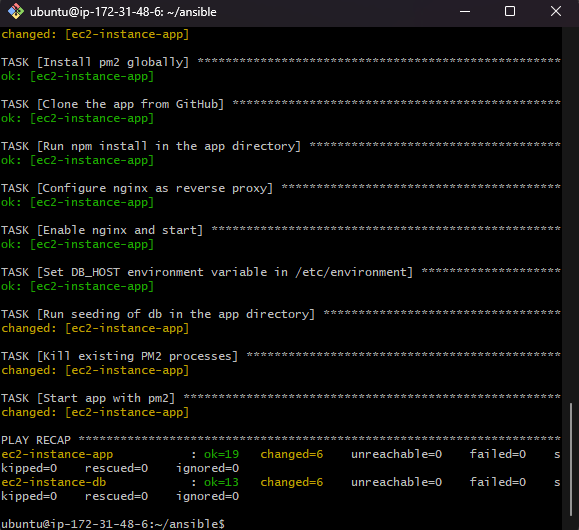