# DevOps Project 10 – Use Kubernetes to Create a 2-Tier Deployment

## Why is Kubernetes Needed?
Kubernetes manages containerized applications efficiently across clusters of machines. It automates deployment, scaling, and operation of application containers.

## Key Challenges Addressed by Kubernetes

- Managing multiple containers across nodes
- Ensuring high availability and fault tolerance
- Scaling applications automatically based on demand
- Managing configuration and secrets securely
- Rolling updates and rollbacks with zero downtime

## Benefits of Kubernetes

- Automation: Automates deployment, scaling, and management of containerized applications.

- Scalability: Dynamically scales applications based on demand.

- Portability: Easily move workloads across cloud providers and on-premises environments.

- Resource Efficiency: Optimizes hardware utilization through intelligent scheduling.

- Self-healing: Automatically restarts failed containers and reschedules workloads when nodes fail.

- Service Discovery & Load Balancing: Efficiently manages internal networking between services.

## The Cluster Setup

### What is a Cluster?

A cluster is a group of machines running Kubernetes, managed together to provide scalable application deployment.

### Master vs Worker Nodes

Master Node: Controls and manages the cluster.

- Components: API Server, Controller Manager, Scheduler, etcd.

Worker Node: Runs the application workloads.

- Components: Kubelet, Kube Proxy, Container Runtime.

**Managed service:**
- Reduced operational overhead.
- Automatic upgrades and patches. 
- Less control over cluster configurations (disadvantage).
- Potential cost increase for advanced customisations (disadvantage).

**Self-hosted:**
- Full control over configurations.
- Suitable for specialized security or networking requirements. 
- Higher operational burden (disadvantage).
- Manual scaling and updates required (disadvantage).

### Control Plane vs Data Plane
- Control Plane: Manages cluster state, handles scheduling, and monitors node health.

- Data Plane: Hosts the actual application workloads and manages network routing.

## Kubernetes Objects

### Common Kubernetes Objects

- Pod: Smallest deployable unit, encapsulating one or more containers.

- Deployment: Ensures desired state for application instances and manages updates.

- ReplicaSet: Maintains a specified number of identical pod instances.

- Service: Exposes application functionality to internal or external traffic.

- ConfigMap & Secret: Manage environment variables and sensitive data.

## What Does it Mean a Pod is "Ephemeral"?

- Pods are designed to be temporary and can be recreated automatically if they fail. Persistent data should be stored outside the pod using Volumes or external storage solutions.

### Mitigating Security Concerns with Containers

- Use Minimal Base Images: Reduces the attack surface.

- Regularly Scan Images: Identify vulnerabilities before deployment.

- Role-Based Access Control (RBAC): Limits permissions for users and services.

- Network Policies: Restrict pod-to-pod communication to reduce attack vectors.

- Pod Security Policies: Define security settings for pods to enforce best practices.

- Use Namespace Isolation: Reduces blast radius in case of a security breach.

## Maintained Images

- Maintained images are regularly updated container base images with security patches and improvements provided by trusted organizations.

### Pros of Using Maintained Images

- Security: Regularly patched for known vulnerabilities.

- Stability: Pre-tested to ensure functionality.

- Best Practices: Often follow security and efficiency guidelines.

### Cons of Using Maintained Images

- Limited Customization: May require additional configurations to meet unique requirements.

- Potential Bloat: May include unused tools or libraries.

# LAB: Use kubernetes to create a 2-tier app deployment.


.png>)


1. Open docker desktop - go to settings - kubernetes - enable kubernetes. 
2. Run `kubectl get service` to see if kubernetes is running. No connection means its not running. 

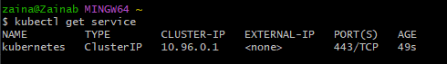

- Enter git bash terminal for this project.
- Create a yaml file called `nginx-deploy.yml`. 

```
apiVersion: apps/v1
kind: Deployment
metadata:
  name: nginx-deployment
  labels:
    app: nginx
spec:
  replicas: 3
  selector:
    matchLabels:
      app: nginx
  template:
    metadata:
      labels:
        app: nginx
    spec:
      containers:
        - name: nginx
          image: daraymonsta/nginx-257:dreamteam
          ports:
            - containerPort: 80

```
- Run this file using `kubectl apply -f nginx-deploy.yml`

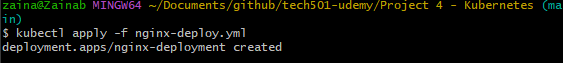

- Check deployment details - `kubectl get deployment nginx-deployment`
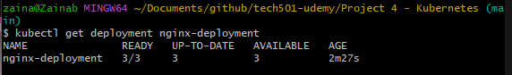

- Check replicaSets details - `kubectl get replicaset`
- Check pod details - `kubectl get pods`
- All in 3 command - `kubectl get all -l app=nginx`

`kubectl get svc` - lists services in a kubernetes cluster.  

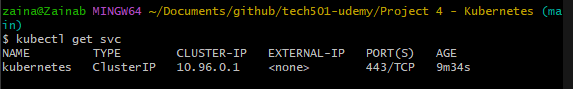

This only shows the default kubernetes service, not the nginx deployment. 

To expose the deployment - 
- `kubectl expose deployment nginx-deployment --type=NodePort --port=80`
- This exposes the app externally on a random port number externally.
- The --port=80 means inside the cluster, your service listens on port 80.
- But Kubernetes doesn't expose port 80 directly to the outside world for security reasons.

To access the application now:
`kubectl get svc`

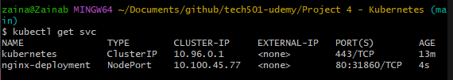

- Access the application on localhost:port (shown in picture above).
- `http://127.0.0.1:31860/`

## Get a NodePort service running (another way to bring app externally online):

In yaml file: nginx-service.yml

```
apiVersion: v1
kind: Service
metadata:
  name: nginx-svc
spec:
  type: NodePort
  selector:
    app: nginx
  ports:
    - port: 80           # The service port (internal)
      targetPort: 80     # The container's port
      nodePort: 30001    # The external port on the node
```

- `kubectl apply -f nginx-service.yml`
- `kubectl get svc nginx-svc`
- Access the app on `http://127.0.0.1:30001/`

**Commands:**
- `kubectl get pods`
- Delete one of the pods - `kubectl delete pod <podname>`.

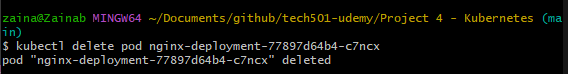

- When you list pods again using `kubectl get pods`, you should still see 3 pods - deployment automatically spins up a replacement pod to maintain the desired replica count. 

### Using a command to get detailed info about a specific pod (e.g the newest pod):
- Sort out the pods by order of age: `kubectl get pods --sort-by=.metadata.creationTimestamp`
- Then describe the newest pod: `kubectl describe pod <NEWEST_POD_NAME>`
- `kubectl describe pod nginx-deployment-77897d64b4-6sl2l`  

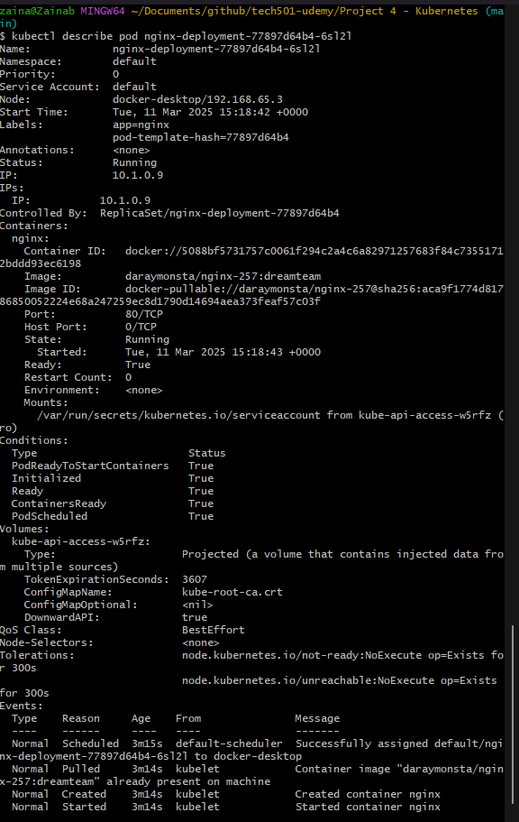

## Increasing replicas with no downtime:

- Method 1: Edit the deployment file in real-time
  - `kubectl get deployments`
  - `kubectl edit deployment nginx-deployment`
  - Change the replicas from 3 to 4 and save file and close it to apply changes. 
  - `kubectl get deployment nginx-deployment` - should now show 4 nodes instead of 3. 
  - `kubectl get pods` - should also show 4 pods now. 

- Method 2: Apply a modified deployment file
  - Edit the actual nginx-deploy.yml file and change replicas from 3 to 5. 
  - `nano nginx-deploy.yml` - edit the deployment file. 
  - `kubectl apply -f nginx-deploy.yml` - apply the changes. 
  - `kubectl get pods` - should show 5 pods now instead of 4 from previous method. 
  - `kubectl get deployment nginx-deployment` - should show 5 nodes. 

- Method 3: Use the scale command
  - `kubectl scale deployment nginx-deployment --replicas=6`
  - `kubectl get pods` - should show 6. 

## Delete kubernetes deployments and services
- `kubectl delete -f nginx-deploy.yml`
- `kubectl delete -f nginx-service.yml`
- `kubectl get deployments` - verify deletion.
- `kubectl get services` - verify service deletion.
- `kubectl get rs` - verify replica sets are deleted.
- `kubectl get pods` - check if pods are deleted.

## Task: K8s deployment of NodeJS Sparta test app

- Create a new folder called `app` - `mkdir app` in the kubernetes repo.
- Copy the previous nginx and service files to the new folder and rename them:
`cp nginx-deploy.yml app/nodejs-deploy.yml`
`cp nginx-service.yml app/nodejs-service.yml`

- nodejs-deploy.yml file:

```

apiVersion: apps/v1
kind: Deployment
metadata:
  name: nodejs-deployment
  labels:
    app: nodejs
spec:
  replicas: 3
  selector:
    matchLabels:
      app: nodejs
  template:
    metadata:
      labels:
        app: nodejs
    spec:
      containers:
        - name: nodejs-app
          image: zainab7861/zainab-sparta-app:v3
          ports:
            - containerPort: 3000


```

- nginx-service.yml file:
```
apiVersion: v1
kind: Service
metadata:
  name: nodejs-service
spec:
  selector:
    app: nodejs
  ports:
    - protocol: TCP
      port: 80
      targetPort: 3000
  type: LoadBalancer

```

- `kubectl apply -f nodejs-deploy.yml`
- `kubectl apply -f nodejs-service.yml`
- `kubectl get deployments` - should see 3 replicas deployed. 
- `kubectl get svc` - should show Ip of app.
  
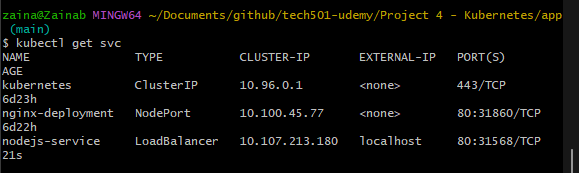

To access the app:
- `http://127.0.0.1/` (local host)


### Creating a deployment for the database:

- Create a new folder called db.
- Create 3 files: 
  - `mongo-service.yml`  
  - `nodejs-mongo-deploy.yml`
  - `nodejs-service.yml`

nodejs-mongo-deploy.yml:

```
apiVersion: apps/v1
kind: Deployment
metadata:
  name: nodejs-deployment
  labels:
    app: nodejs
spec:
  replicas: 3
  selector:
    matchLabels:
      app: nodejs
  template:
    metadata:
      labels:
        app: nodejs
    spec:
      containers:
        - name: nodejs-app
          image: zainab7861/zainab-sparta-app:v3
          ports:
            - containerPort: 3000
          env:
            - name: DB_HOST
              value: "mongodb://mongo-service:27017/posts"
            - name: EXECUTE_NPM_INSTALL
              value: "false"

---
apiVersion: apps/v1
kind: Deployment
metadata:
  name: mongo-deployment
  labels:
    app: mongo
spec:
  replicas: 1
  selector:
    matchLabels:
      app: mongo
  template:
    metadata:
      labels:
        app: mongo
    spec:
      containers:
        - name: mongo
          image: mongo:latest
          ports:
            - containerPort: 27017
          volumeMounts:
            - name: mongo-storage
              mountPath: /data/db
      volumes:
        - name: mongo-storage
          persistentVolumeClaim:
            claimName: mongo-pvc


```

mongo-service.yml:

```
apiVersion: v1
kind: Service
metadata:
  name: mongo-service
spec:
  selector:
    app: mongo
  ports:
    - protocol: TCP
      port: 27017
      targetPort: 27017
  type: ClusterIP

```
nodejs-service.yml:

```
apiVersion: v1
kind: Service
metadata:
  name: nodejs-service
spec:
  selector:
    app: nodejs
  ports:
    - protocol: TCP
      port: 3000
      targetPort: 3000
      nodePort: 30001
  type: NodePort

```

- Apply all of these files:
  - `kubectl apply -f nodejs-service.yml`
  - `kubectl apply -f nodejs-mongo-deploy.yml`
  - `kubectl apply -f mongo-service.yml`

- To access app: find out through `kubectl get svc` 

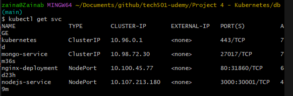

- Access app through: `http://127.0.0.1:30001/`
- `kubectl get pods | grep mongo` - shows mongodb running.

Posts page works but the database isnt seeded (need a separate job for that).

## Seed the db:

- Enter the app and manually `npm install`
- To enter the app, on docker desktop, view the current running containers and find the one which is running the app: could also do `docker ps` in git bash terminal.

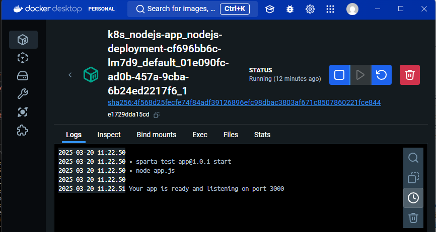

- Then, copy the id of the container and run this command in git bash:
  - `docker exec -it <containerid> sh`
  - Then `ls` to make sure it has application. 
  - Then run `npm install`

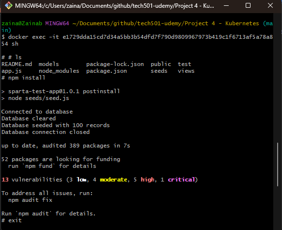

  - Once completed, the posts page should be working

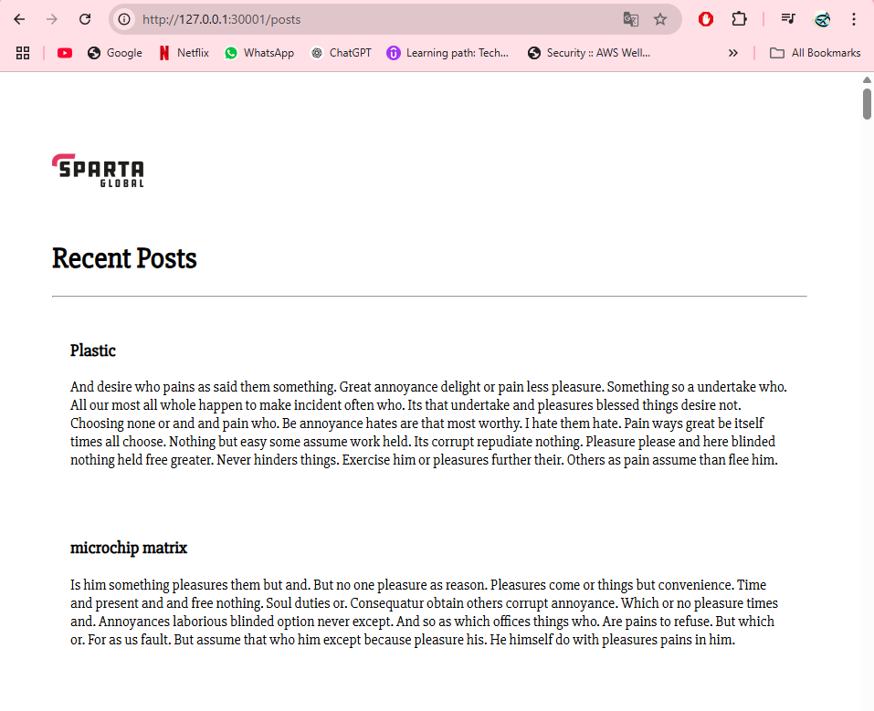

## Task: Create 2-tier deployment with PV for database

- Persistent volume = piece of storage in your cluster that persists beyond pod restarts. 
- Create a new file for the pv called nodejs-pv.yml
- Add the contents for the pv file:

```
apiVersion: v1
kind: PersistentVolume
metadata:
  name: mongo-pv
spec:
  capacity:
    storage: 1Gi  # Adjust as needed
  accessModes:
    - ReadWriteOnce
  persistentVolumeReclaimPolicy: Delete
  hostPath:
    path: "/data/mongo"  # Storage path on the node

```
- Apply the file: `kubectl apply -f nodejs-pv.yml`

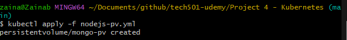

- Can check the pv with `kubectl get pv`

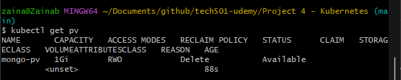

- Also create a pv claim file so mongodb can request storage from the pv:
- Create a file called nodejs-pvc.yml
- Enter the contents: 

```
apiVersion: v1
kind: PersistentVolumeClaim
metadata:
  name: mongo-pvc
spec:
  accessModes:
    - ReadWriteOnce
  resources:
    requests:
      storage: 1Gi

```

- Apply the file: `kubectl apply -f nodejs-pvc.yml`

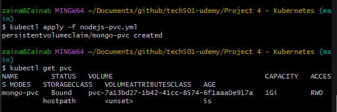

### Testing the pv:

- Delete the mongo deployment - `kubectl get deployments`
- `kubectl delete deployment mongo-deployment`
- Apply the deployment again - `kubectl apply -f nodejs-mongo-deploy.yml`
- Check the posts page - data should be unchanged and same as before.

 **BLOCKER!** Post page needs reseeding. The pv may not be working properly:

 - So, it doesnt work when deleting deployments because I manually seeded the db and I need to do that everytime I create a db deployment. Use pods to test instead!! See below:

### Troubleshooting:

- `kubectl get pv` - Shows that the pvc is bound.
- `kubectl get pods` - shows all your pods. Need mongo pod id. 
- `kubectl describe pods mongo-deployment-6fdb84fb66-n2slw` - In the volumes section should see its attached to the pvc. 
- `kubectl get pods`
- `$ kubectl exec -it mongo-deployment-6fdb84fb66-n2slw  -- sh` - Enter the mongo pod. 
- `ls -lah /data/db` to check if the database is storing data correctly - should have a lot of files and wt files. 
- exit and then delete the pod not deployment. 
- `kubectl delete pod mongo-deployment-6fdb84fb66-n2slw`
- It should automatically be replaced - check posts page - should have same data if using the pv. 
- So, the pv works when deleting pods but not when i delete the deployment- have to reseed manually and the data is different because I re-create the db! Makes sense to have to re-seed. 

## Autoscaling with kubernetes
- Horizontal Pod Autoscaler (HPA)- scales the number of pods up/down based on CPU, memory or custom metrics. 
  - To check if metrics are available: `kubectl top pods`.
- Vertical Pod Autoscaler (VPA)- automatically adjusts CPU and memory requests for pods instead of adding more pods. 
- Cluster Autoscaler- scales the number of worker nodes in a cluster when pods cannot be scheduled due to resource constraints. 

### Task: Use Horizontal Pod Autoscaler (HPA) to scale the app
- Install metrics server: `kubectl apply -f https://github.com/kubernetes-sigs/metrics-server/releases/latest/download/components.yaml`.
- Apply the autoscaler to your app: `kubectl autoscale deployment nodejs-deployment --cpu-percent=50 --min=2 --max=10`.
- Check if the autoscaling was created: `kubectl get hpa`.

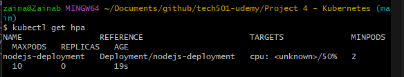

### Load testing with apache bench
- Install apache bench in powershell run as administrator - won't be able to install in git bash since apt won't work. 
  - `choco install apache-httpd -y`
- Need to add it to bash environment
- To find the path: `find /c/Users/zaina/AppData/Roaming -name "ab.exe" 2>/dev/null`

- In Git bash set env path for apachebench. 

```
echo 'export PATH=$PATH:/c/Users/zaina/AppData/Roaming/Apache24/bin' >> ~/.bashrc
source ~/.bashrc
```
- Then verify installation: `ab -V`
- Show show apachebench version. 

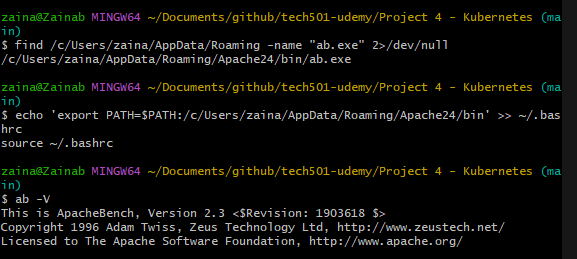

- Load testing: `ab -n 100 -c 10 http://localhost:30001/`
- Check using `kubectl top pods` or `kubectl top nodes`
- Load is too low- increase it- `ab -n 10000 -c 100 http://localhost:8080/`

## Task: Setup minikube on a cloud instance running Ubuntu 22.04 LTS

- Create an AWS ec2 instance to run the minikube on:
  - Make sure it's t3a.small not micro. 
  - SSH into it- `ssh -i ~/.ssh/aws-key-zainab.pem ubuntu@54.229.23.234`
  - Run some updates- `sudo apt update && sudo apt install -y curl wget apt-transport-https`
  - Install minikube- 
```
  curl -LO https://storage.googleapis.com/minikube/releases/latest/minikube-linux-amd64
sudo install minikube-linux-amd64 /usr/local/
```

  - Install and run docker-
```
sudo apt update
sudo apt install -y docker.io
sudo systemctl start docker
sudo systemctl enable docker
docker --version

```
- Add yourself to the docker group-  `sudo usermod -aG docker $USER`
- Apply the changes- `newgrp docker`
- Start minikube- `minikube start --driver=docker`

### Task: Deploy on three apps on one cloud instance running minikube

- Create a file called first-app.yml with the contents:

```
apiVersion: apps/v1
kind: Deployment
metadata:
  name: first-app
spec:
  replicas: 5
  selector:
    matchLabels:
      app: first-app
  template:
    metadata:
      labels:
        app: first-app
    spec:
      containers:
      - name: first-app
        image: daraymonsta/nginx-257:dreamteam
        ports:
        - containerPort: 80
---
apiVersion: v1
kind: Service
metadata:
  name: first-app-service
spec:
  type: NodePort
  selector:
    app: first-app
  ports:
  - protocol: TCP
    port: 80
    targetPort: 80
    nodePort: 30001

```
- Deploy this yml file- `kubectl apply -f first-app.yaml`
- Confirm its working- `curl <minikube ip>:30001`
- If its working, should show the nginx html page. 
- To access it externally, configure an nginx reverse proxy to forward requests from port 80 to the minikube port 30001.

### Nginx reverse proxy
- Install nginx for the reverse proxy- `sudo apt install -y nginx`
- Edit the config file for reverse proxy- `sudo nano /etc/nginx/sites-available/default` :
- Replace the try files line in location. 

```

        location / {
            proxy_pass http://minikubeIp:30001;
        }

```
- Save and reload the nginx service.
- `sudo nginx -t` - tells you if the config file syntax is okay.
- `sudo systemctl reload nginx` - reload the service. 
- Access the application with nginx by going to ec2 public ip on port 80. 

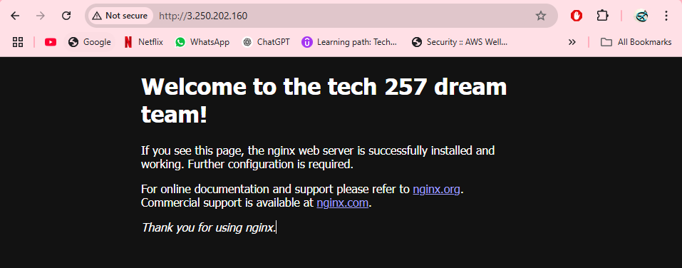

### Create a 2nd app file:
- Name =  `second-app.yml`

```
apiVersion: apps/v1
kind: Deployment
metadata:
  name: second-app
spec:
  replicas: 2
  selector:
    matchLabels:
      app: second-app
  template:
    metadata:
      labels:
        app: second-app
    spec:
      containers:
      - name: second-app
        image: daraymonsta/tech201-nginx-auto:v1
        ports:
        - containerPort: 80
---
apiVersion: v1
kind: Service
metadata:
  name: second-app-service
spec:
  type: LoadBalancer
  selector:
    app: second-app
  ports:
  - protocol: TCP
    port: 9000 # External load balancer port
    targetPort: 80 # Container port
    nodePort: 30002 

```
- Loadbalancer is exposed on port 9000.
- Container exposed on port 80. 
(<lb_external_ip>:9000 endpoint via minikube tunnel) 

- Nodeport 30002 is optional. Load balancer services won't use this but in minikube a loadbalancer is a wrapper around a nodeport and this nodeport is automatically assigned. In my case, I have explicitly chosen 30002.

- Deploy the app- `kubectl apply -f second-app.yml`
- Start minikube tunnel- `minikube tunnel`
- Check service- `kubectl get service second-app-service`
- Enable tunnel in same ec2 but different terminal window and keep it running- `minikube tunnel`
- Check service again- should see external ip. 
- Test if you can reach the load balancer- `curl externalIp:9000`
- Should show html page:

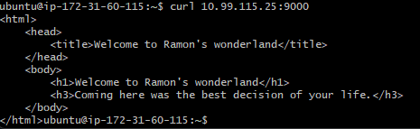

### Why Do We Use minikube tunnel?
Minikube tunnel is used to expose LoadBalancer services in a Minikube cluster so that they can be accessed from outside the cluster, similar to how they would work in a real Kubernetes environment.
Provides an External IP for LoadBalancer Services

- In Minikube, ServiceType: LoadBalancer doesn't automatically get an external IP like in cloud providers (e.g., AWS, GCP).

- minikube tunnel creates a network route that assigns an external IP to your LoadBalancer services.
- Allows Access to Services on localhost

- Once the tunnel is running, you can access the service using the external IP assigned by Minikube.

- minikube tunnel allows the loadbalancer service to be reached from within the ec2. But to be able to access it from outside the ec2, we will need to use nginx reverse proxy.

- Reverse proxy for the 2nd app:
- Config file should look like this:

```
# Default server configuration
server {
    listen 80 default_server;
    listen [::]:80 default_server;

    # SSL configuration (uncomment to use SSL)
    # listen 443 ssl default_server;
    # listen [::]:443 ssl default_server;

    # Note: You should disable gzip for SSL traffic.
    # See: https://bugs.debian.org/773332

    # Self-signed certs generated by the ssl-cert package (not for production use)
    # include snippets/snakeoil.conf;

    root /var/www/html;

    # Add index.php to the list if you are using PHP
    index index.html index.htm index.nginx-debian.html;

    # Default location block
    location / {
        proxy_pass http://192.168.49.2:30001;
    }
}

# Second server block for port 9000
server {
    listen 9000;
    server_name _;

    location / {
        proxy_pass http://10.99.115.25:9000;
    }
}

# Uncomment and configure for PHP scripts if needed
# location ~ \.php$ {
#     include snippets/fastcgi-php.conf;
#     fastcgi_pass unix:/run/php/php7.4-fpm.sock;
#     fastcgi_param SCRIPT_FILENAME $document_root$fastcgi_script_name;
#     include fastcgi_params;
# }

# Deny access to .htaccess files, if Apache's document root
# concurs with nginx's one
# location ~ /\.ht {
#     deny all;
# }


```
- Reload nginx `sudo systemctl restart nginx`

- To access the application: `ec2PubIp:9000`
  


### 3rd app- 
- Hello minikube app
- 
```
kubectl create deployment hello-minikube --image=kicbase/echo-server:1.0
kubectl expose deployment hello-minikube --type=LoadBalancer --port=8080

```
- `kubectl get deployments` should show hello minikube deployment. 

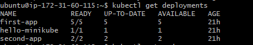

- `kubectl get pods` should show hello minikube pod:

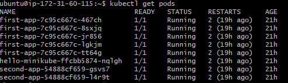

- `kubectl get svc` - to check lb.

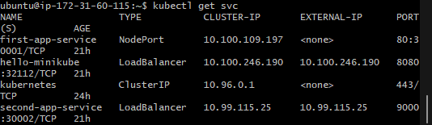

- Can access the lb with `curl externalIp:8080`
- Configure nginx reverse proxy for this app: In the default section

```

 location /hello {
                proxy_pass http://ExternalHelloWorldIp:8080;

 }

```
- Config file should look like this:

```
# Default server configuration
server {
    listen 80 default_server;
    listen [::]:80 default_server;

    # SSL configuration (uncomment to use SSL)
    # listen 443 ssl default_server;
    # listen [::]:443 ssl default_server;

    # Note: You should disable gzip for SSL traffic.
    # See: https://bugs.debian.org/773332

    # Self-signed certs generated by the ssl-cert package (not for production use)
    # include snippets/snakeoil.conf;

    root /var/www/html;

    # Add index.php to the list if you are using PHP
    index index.html index.htm index.nginx-debian.html;

    # Default location block
    location / {
        proxy_pass http://192.168.49.2:30001;
    }

    location /hello {
        proxy_pass http://10.100.246.190:8080;

 }
}

# Second server block for port 9000
server {
    listen 9000;
    server_name _;

    location / {
        proxy_pass http://10.99.115.25:9000;
    }
}

# Uncomment and configure for PHP scripts if needed
# location ~ \.php$ {
#     include snippets/fastcgi-php.conf;
#     fastcgi_pass unix:/run/php/php7.4-fpm.sock;
#     fastcgi_param SCRIPT_FILENAME $document_root$fastcgi_script_name;
#     include fastcgi_params;
# }

# Deny access to .htaccess files, if Apache's document root
# concurs with nginx's one
# location ~ /\.ht {
#     deny all;
# }


```
- Restart nginx - `sudo systemctl restart nginx`
- In browser- access app through `EC2Ip/hello`

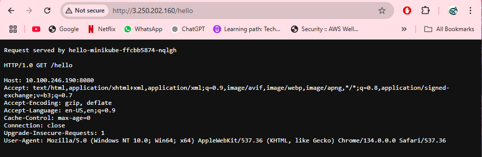

- To get rid of all this / clean up: `kubectl delete all --all`

## Task: Use Kubernetes to deploy the Sparta test app in the cloud

- Using the same yml files as on local environment:
- `minikube start`

- `nano nodejs-pv.yml`

```
apiVersion: v1
kind: PersistentVolume
metadata:
  name: mongo-pv
spec:
  capacity:
    storage: 1Gi  # Adjust as needed
  accessModes:
    - ReadWriteOnce
  persistentVolumeReclaimPolicy: Delete
  hostPath:
    path: "/data/mongo"  # Storage path on the node


```
- `nano nodejs-pvc.yml`

```
apiVersion: v1
kind: PersistentVolumeClaim
metadata:
  name: mongo-pvc
spec:
  accessModes:
    - ReadWriteOnce
  resources:
    requests:
      storage: 1Gi


```


- `nano sparta-app.yml`

```

apiVersion: apps/v1
kind: Deployment
metadata:
  name: mongo-deployment
  labels:
    app: mongo  
spec:
  replicas: 1
  selector:
    matchLabels:
      app: mongo
  template:
    metadata:
      labels:
        app: mongo
    spec:
      containers:
        - name: mongo
          image: mongo:latest
          ports:
            - containerPort: 27017
          volumeMounts:
            - name: mongo-storage
              mountPath: /data/db
          resources: 
            requests:
              memory: "256Mi"
              cpu: "250m"
            limits:
              memory: "0.5Gi"
              cpu: "500m"
      volumes:
        - name: mongo-storage
          persistentVolumeClaim:
            claimName: mongo-pvc
---
apiVersion: v1
kind: Service
metadata:
  name: mongodb-service
spec:
  type: NodePort  
  selector:
    app: mongo  
  ports:
    - protocol: TCP
      port: 27017  
      targetPort: 27017
  type: ClusterIP

---
apiVersion: apps/v1
kind: Deployment
metadata:
  name: nodejs-deployment
  labels:
    app: nodejs
spec:
  replicas: 3
  selector:
    matchLabels:
      app: nodejs
  template:
    metadata:
      labels:
        app: nodejs
    spec:
      containers:
        - name: nodejs-app
          image: zainab7861/zainab-sparta-app:v3
          ports:
            - containerPort: 3000
          env:
            - name: DB_HOST
              value: "mongodb://mongodb-service:27017/posts"  
            - name: EXECUTE_NPM_INSTALL
              value: "false"
          resources:
            requests:
              cpu: "100m"
            limits:
              cpu: "500m"
---
apiVersion: v1
kind: Service
metadata:
  name: nodejs-service
spec:
  type: NodePort  
  selector:
    app: nodejs
  ports:
    - protocol: TCP
      port: 3000
      targetPort: 3000
      nodePort: 30002  


```
- The nginx reverse proxy file:
- Delete the previous nginx config:

```
sudo systemctl stop nginx
 
sudo apt-get purge nginx nginx-common nginx-full
 
sudo apt-get autoremove
 
sudo rm -rf /etc/nginx
 
```
- Install nginx again:
  - `sudo apt install nginx`.
- Check the file is configured well `sudo nginx -t`.
- Edit the file for reverse proxy `sudo nano /etc/nginx/sites-available/default`

```
##
# You should look at the following URL's in order to grasp a solid understanding
# of Nginx configuration files in order to fully unleash the power of Nginx.
# https://www.nginx.com/resources/wiki/start/
# https://www.nginx.com/resources/wiki/start/topics/tutorials/config_pitfalls/
# https://wiki.debian.org/Nginx/DirectoryStructure
#
# In most cases, administrators will remove this file from sites-enabled/ and
# leave it as reference inside of sites-available where it will continue to be
# updated by the nginx packaging team.
#
# This file will automatically load configuration files provided by other
# applications, such as Drupal or Wordpress. These applications will be made
# available underneath a path with that package name, such as /drupal8.
#
# Please see /usr/share/doc/nginx-doc/examples/ for more detailed examples.
##

# Default server configuration
#
server {
        listen 80 default_server;
        listen [::]:80 default_server;

        # SSL configuration
        #
        # listen 443 ssl default_server;
        # listen [::]:443 ssl default_server;
        #
        # Note: You should disable gzip for SSL traffic.
        # See: https://bugs.debian.org/773332
        #
        # Read up on ssl_ciphers to ensure a secure configuration.
        # See: https://bugs.debian.org/765782
        #
        # Self signed certs generated by the ssl-cert package
        # Don't use them in a production server!
        #
        # include snippets/snakeoil.conf;

        root /var/www/html;

        # Add index.php to the list if you are using PHP
        index index.html index.htm index.nginx-debian.html;

        server_name _;

        location / {
                # First attempt to serve request as file, then
                # as directory, then fall back to displaying a 40
                proxy_pass http://192.168.49.2:30002;
        }

        # pass PHP scripts to FastCGI server
        #
        #location ~ \.php$ {
        #       include snippets/fastcgi-php.conf;
        #
        #       # With php-fpm (or other unix sockets):
        #       fastcgi_pass unix:/run/php/php7.4-fpm.sock;
        #       # With php-cgi (or other tcp sockets):
        #       fastcgi_pass 127.0.0.1:9000;
        #}

        # deny access to .htaccess files, if Apache's document root
        # concurs with nginx's one
        #
        #location ~ /\.ht {
        #       deny all;
        #}
}


# Virtual Host configuration for example.com
#
# You can move that to a different file under sites-available/ and symlink that
# to sites-enabled/ to enable it.
#
#server {
#       listen 80;
#       listen [::]:80;
#
#       server_name example.com;
#
#       root /var/www/example.com;
#       index index.html;
#
#       location / {
#               try_files $uri $uri/ =404;
#       }
#}

```
- `sudo systemctl restart nginx`
- App and post page should work! `http://34.240.212.209/`

### load balancing

- Change the ec2 storage from 8 to 12gb - in ec2 - storage
- Restart the ec2.
- `minikube start` - make sure app works. 
- `kubectl apply -f sparta-app.yml`

- `minikube addons enable metrics-server`
- `kubectl get deployments`
- `kubectl autoscale deployment nodejs-deployment --cpu-percent=20 --min=2 --max=10`
- `kubectl get hpa`
- `sudo apt install apache2-utils -y`
- `minikube ip`
- `ab -n 2000 -c 50 "http://192.168.49.2:30002/"`
- `kubectl get hpa -w` - keep this running in a different tab- shows you live updates of how much cpu is being used.
- `kubectl get pods` - should see more pods being deployed.
- `kubectl describe deployment nodejs-deployment` 

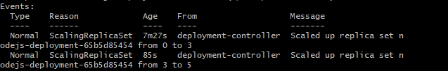

- `kubectl get pods`
  
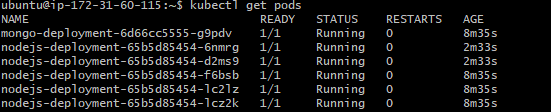

- After a while, the scaling will decrease when cpu does.

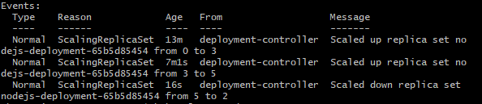

## Automating the minikube start command (so don't have to run that command everytime to run app)

- `sudo nano /etc/systemd/system/minikube.service`

```
[Unit]
Description=Minikube Kubernetes Cluster
After=network-online.target firewalld.service containerd.service docker.service #>
Wants=network-online.target docker.service
Requires=docker.socket containerd.service docker.service # ensure running before >

[Service]
Type=oneshot
RemainAfterExit=yes
ExecStart=/usr/local/bin/minikube start --driver=docker
ExecStop=/usr/local/bin/minikube stop # stops minikube gracefully on shutdown
User=ubuntu

[Install]
WantedBy=multi-user.target

```
- `sudo systemctl daemon-reload`
- `sudo systemctl enable minikube`
- `sudo systemctl start minikube`
- `sudo systemctl status minikube`

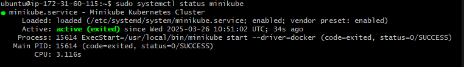
- `sudo systemctl restart minikube`
- `sudo systemctl stop minikube`
- Restart the vm - should be able to access the app 
If you enter vm: minikube should automatically be running

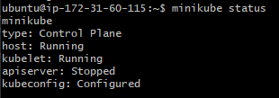

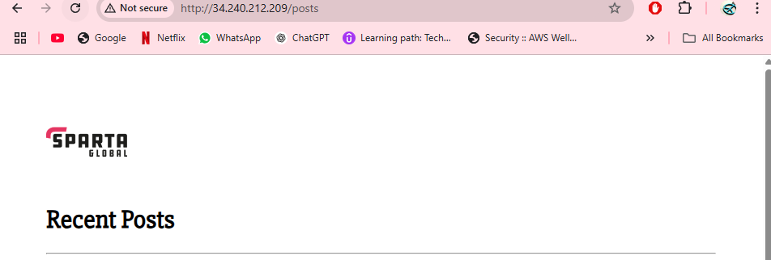


