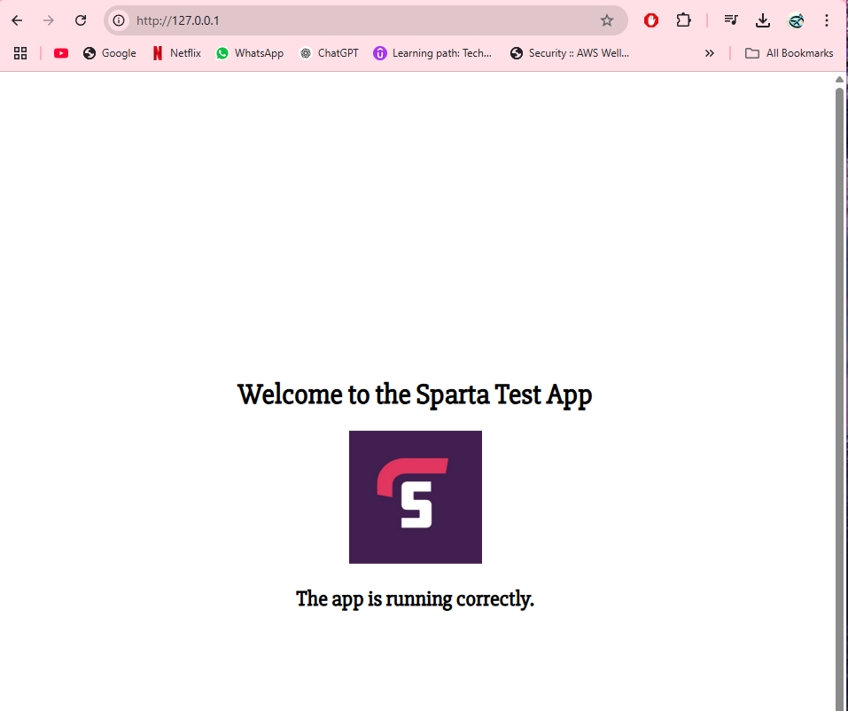

# DevOps Project 10 – Use Kubernetes to Create a 2-Tier Deployment

## Why is Kubernetes Needed?
Kubernetes manages containerized applications efficiently across clusters of machines. It automates deployment, scaling, and operation of application containers.

## Key Challenges Addressed by Kubernetes

- Managing multiple containers across nodes
- Ensuring high availability and fault tolerance
- Scaling applications automatically based on demand
- Managing configuration and secrets securely
- Rolling updates and rollbacks with zero downtime

## Benefits of Kubernetes

- Automation: Automates deployment, scaling, and management of containerized applications.

- Scalability: Dynamically scales applications based on demand.

- Portability: Easily move workloads across cloud providers and on-premises environments.

- Resource Efficiency: Optimizes hardware utilization through intelligent scheduling.

- Self-healing: Automatically restarts failed containers and reschedules workloads when nodes fail.

- Service Discovery & Load Balancing: Efficiently manages internal networking between services.

## The Cluster Setup

### What is a Cluster?

A cluster is a group of machines running Kubernetes, managed together to provide scalable application deployment.

### Master vs Worker Nodes

Master Node: Controls and manages the cluster.

- Components: API Server, Controller Manager, Scheduler, etcd.

Worker Node: Runs the application workloads.

- Components: Kubelet, Kube Proxy, Container Runtime.

**Managed service:**
- Reduced operational overhead.
- Automatic upgrades and patches. 
- Less control over cluster configurations (disadvantage).
- Potential cost increase for advanced customisations (disadvantage).

**Self-hosted:**
- Full control over configurations.
- Suitable for specialized security or networking requirements. 
- Higher operational burden (disadvantage).
- Manual scaling and updates required (disadvantage).

### Control Plane vs Data Plane
- Control Plane: Manages cluster state, handles scheduling, and monitors node health.

- Data Plane: Hosts the actual application workloads and manages network routing.

## Kubernetes Objects

### Common Kubernetes Objects

- Pod: Smallest deployable unit, encapsulating one or more containers.

- Deployment: Ensures desired state for application instances and manages updates.

- ReplicaSet: Maintains a specified number of identical pod instances.

- Service: Exposes application functionality to internal or external traffic.

- ConfigMap & Secret: Manage environment variables and sensitive data.

## What Does it Mean a Pod is "Ephemeral"?

- Pods are designed to be temporary and can be recreated automatically if they fail. Persistent data should be stored outside the pod using Volumes or external storage solutions.

### Mitigating Security Concerns with Containers

- Use Minimal Base Images: Reduces the attack surface.

- Regularly Scan Images: Identify vulnerabilities before deployment.

- Role-Based Access Control (RBAC): Limits permissions for users and services.

- Network Policies: Restrict pod-to-pod communication to reduce attack vectors.

- Pod Security Policies: Define security settings for pods to enforce best practices.

- Use Namespace Isolation: Reduces blast radius in case of a security breach.

## Maintained Images

- Maintained images are regularly updated container base images with security patches and improvements provided by trusted organizations.

### Pros of Using Maintained Images

- Security: Regularly patched for known vulnerabilities.

- Stability: Pre-tested to ensure functionality.

- Best Practices: Often follow security and efficiency guidelines.

### Cons of Using Maintained Images

- Limited Customization: May require additional configurations to meet unique requirements.

- Potential Bloat: May include unused tools or libraries.

# LAB: Use kubernetes to create a 2-tier app deployment.

1. Open docker desktop - go to settings - kubernetes - enable kubernetes. 
2. Run `kubectl get service` to see if kubernetes is running. No connection means its not running. 


- Enter git bash terminal for this project.
- Create a yaml file called `nginx-deploy.yml`. 

```
apiVersion: apps/v1
kind: Deployment
metadata:
  name: nginx-deployment
  labels:
    app: nginx
spec:
  replicas: 3
  selector:
    matchLabels:
      app: nginx
  template:
    metadata:
      labels:
        app: nginx
    spec:
      containers:
        - name: nginx
          image: daraymonsta/nginx-257:dreamteam
          ports:
            - containerPort: 80

```
- Run this file using `kubectl apply -f nginx-deploy.yml`


- Check deployment details - `kubectl get deployment nginx-deployment`


- Check replicaSets details - `kubectl get replicaset`
- Check pod details - `kubectl get pods`
- All in 3 command - `kubectl get all -l app=nginx`

`kubectl get svc` - lists services in a kubernetes cluster.  


This only shows the default kubernetes service, not the nginx deployment. 

To expose the deployment - 
- `kubectl expose deployment nginx-deployment --type=NodePort --port=80`
- This exposes the app externally on a random port number externally.
- The --port=80 means inside the cluster, your service listens on port 80.
- But Kubernetes doesn't expose port 80 directly to the outside world for security reasons.

To access the application now:
`kubectl get svc`


- Access the application on localhost:port (shown in picture above).
- `http://127.0.0.1:31860/`

## Get a NodePort service running (another way to bring app externally online):

In yaml file: nginx-service.yml

```
apiVersion: v1
kind: Service
metadata:
  name: nginx-svc
spec:
  type: NodePort
  selector:
    app: nginx
  ports:
    - port: 80           # The service port (internal)
      targetPort: 80     # The container's port
      nodePort: 30001    # The external port on the node
```

- `kubectl apply -f nginx-service.yml`
- `kubectl get svc nginx-svc`
- Access the app on `http://127.0.0.1:30001/`

**Commands:**
- `kubectl get pods`
- Delete one of the pods - `kubectl delete pod <podname>`.


- When you list pods again using `kubectl get pods`, you should still see 3 pods - deployment automatically spins up a replacement pod to maintain the desired replica count. 

### Using a command to get detailed info about a specific pod (e.g the newest pod):
- Sort out the pods by order of age: `kubectl get pods --sort-by=.metadata.creationTimestamp`
- Then describe the newest pod: `kubectl describe pod <NEWEST_POD_NAME>`
- `kubectl describe pod nginx-deployment-77897d64b4-6sl2l`  


## Increasing replicas with no downtime:

- Method 1: Edit the deployment file in real-time
  - `kubectl get deployments`
  - `kubectl edit deployment nginx-deployment`
  - Change the replicas from 3 to 4 and save file and close it to apply changes. 
  - `kubectl get deployment nginx-deployment` - should now show 4 nodes instead of 3. 
  - `kubectl get pods` - should also show 4 pods now. 

- Method 2: Apply a modified deployment file
  - Edit the actual nginx-deploy.yml file and change replicas from 3 to 5. 
  - `nano nginx-deploy.yml` - edit the deployment file. 
  - `kubectl apply -f nginx-deploy.yml` - apply the changes. 
  - `kubectl get pods` - should show 5 pods now instead of 4 from previous method. 
  - `kubectl get deployment nginx-deployment` - should show 5 nodes. 

- Method 3: Use the scale command
  - `kubectl scale deployment nginx-deployment --replicas=6`
  - `kubectl get pods` - should show 6. 

## Delete kubernetes deployments and services
- `kubectl delete -f nginx-deploy.yml`
- `kubectl delete -f nginx-service.yml`
- `kubectl get deployments` - verify deletion.
- `kubectl get services` - verify service deletion.
- `kubectl get rs` - verify replica sets are deleted.
- `kubectl get pods` - check if pods are deleted.

## Task: K8s deployment of NodeJS Sparta test app

- Create a new folder called `app` - `mkdir app` in the kubernetes repo.
- Copy the previous nginx and service files to the new folder and rename them:
`cp nginx-deploy.yml app/nodejs-deploy.yml`
`cp nginx-service.yml app/nodejs-service.yml`

- nodejs-deploy.yml file:

```

apiVersion: apps/v1
kind: Deployment
metadata:
  name: nodejs-deployment
  labels:
    app: nodejs
spec:
  replicas: 3
  selector:
    matchLabels:
      app: nodejs
  template:
    metadata:
      labels:
        app: nodejs
    spec:
      containers:
        - name: nodejs-app
          image: zainab7861/zainab-sparta-app:v3
          ports:
            - containerPort: 3000


```

- nginx-service.yml file:
```
apiVersion: v1
kind: Service
metadata:
  name: nodejs-service
spec:
  selector:
    app: nodejs
  ports:
    - protocol: TCP
      port: 80
      targetPort: 3000
  type: LoadBalancer

```

- `kubectl apply -f nodejs-deploy.yml`
- `kubectl apply -f nodejs-service.yml`
- `kubectl get deployments` - should see 3 replicas deployed. 
- `kubectl get svc` - should show Ip of app.
  


To access the app:
- `http://127.0.0.1/` (local host)



### Creating a deployment for the database:

- Create a new folder called db.
- Create 3 files: 
  - `mongo-service.yml`  
  - `nodejs-mongo-deploy.yml`
  - `nodejs-service.yml`

nodejs-mongo-deploy.yml:

```
apiVersion: apps/v1
kind: Deployment
metadata:
  name: nodejs-deployment
  labels:
    app: nodejs
spec:
  replicas: 3
  selector:
    matchLabels:
      app: nodejs
  template:
    metadata:
      labels:
        app: nodejs
    spec:
      containers:
        - name: nodejs-app
          image: zainab7861/zainab-sparta-app:v3
          ports:
            - containerPort: 3000
          env:
            - name: DB_HOST
              value: "mongodb://mongo-service:27017/posts"
            - name: EXECUTE_NPM_INSTALL
              value: "false"

---
apiVersion: apps/v1
kind: Deployment
metadata:
  name: mongo-deployment
  labels:
    app: mongo
spec:
  replicas: 1
  selector:
    matchLabels:
      app: mongo
  template:
    metadata:
      labels:
        app: mongo
    spec:
      containers:
        - name: mongo
          image: mongo:latest
          ports:
            - containerPort: 27017
          volumeMounts:
            - name: mongo-storage
              mountPath: /data/db
      volumes:
        - name: mongo-storage
          persistentVolumeClaim:
            claimName: mongo-pvc


```

mongo-service.yml:

```
apiVersion: v1
kind: Service
metadata:
  name: mongo-service
spec:
  selector:
    app: mongo
  ports:
    - protocol: TCP
      port: 27017
      targetPort: 27017
  type: ClusterIP

```
nodejs-service.yml:

```
apiVersion: v1
kind: Service
metadata:
  name: nodejs-service
spec:
  selector:
    app: nodejs
  ports:
    - protocol: TCP
      port: 3000
      targetPort: 3000
      nodePort: 30001
  type: NodePort

```

- Apply all of these files:
  - `kubectl apply -f nodejs-service.yml`
  - `kubectl apply -f nodejs-mongo-deploy.yml`
  - `kubectl apply -f mongo-service.yml`

- To access app: find out through `kubectl get svc` 


- Access app through: `http://127.0.0.1:30001/`
- `kubectl get pods | grep mongo` - shows mongodb running.
- 
