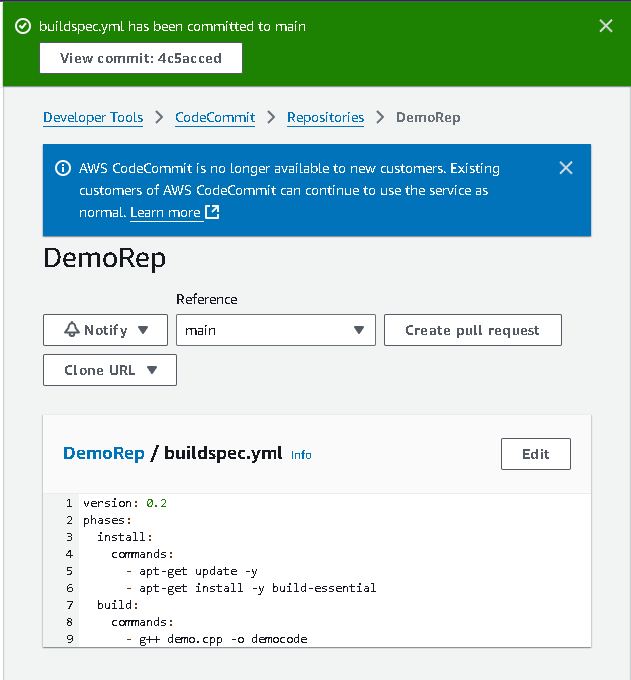
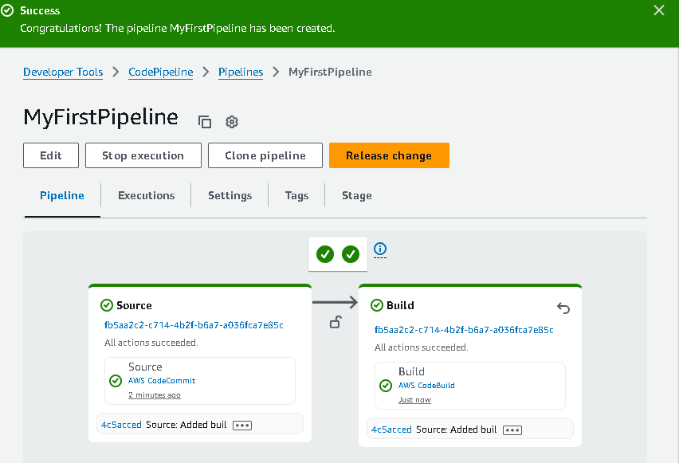

# Continuous Integration Pipeline Using AWS CodeCommit, CodeBuild and CodePipeline

1. Set up AWS CodeCommit repository to store app code:
   - Name: DemoRep
   - Create.
   - In the new repo you created, create a new file. Paste in these contents:

```
#include <iostream>

int main()
{
  std::cout << "Project Build with AWS CodeBuild!\n";
}

```

   - commit.


2. Create a file for codebuild:
   - Create this file in the codecommit repository.
```
version: 0.2
phases:
  install:
    commands:
      - apt-get update -y
      - apt-get install -y build-essential
  build:
    commands:
      - g++ demo.cpp -o democode
```


3. Create a codebuild project
   - Name: DemoBuild
   - Source: AWS codecommit - branch main. 
   - Buildspec: Use a buildspec file
   - Create. 

4. Create a SNS topic
   - This will allow codebuild to send email notifications to developers if there is a build failure. 
   - SNS:
     - Name: fail-build-topic
     - From the basic access policy section- can find the arn. `arn:aws:sns:us-east-1:471320390055:fail-build-topic`
     - In the advanced access policy - add this script and replace the account ID and arn. 

```
{
  "Version": "2008-10-17",
  "Id": "__default_policy_ID",
  "Statement": [
    {
      "Sid": "__default_statement_ID",
      "Effect": "Allow",
      "Principal": {
        "AWS": "*"
      },
      "Action": [
        "SNS:GetTopicAttributes",
        "SNS:SetTopicAttributes",
        "SNS:AddPermission",
        "SNS:RemovePermission",
        "SNS:DeleteTopic",
        "SNS:Subscribe",
        "SNS:ListSubscriptionsByTopic",
        "SNS:Publish",
        "SNS:Receive"
      ],
      "Resource": "arn:aws:sns:us-east-1:471320390055:fail-build-topic",
      "Condition": {
        "StringEquals": {
          "AWS:SourceOwner": "471320390055"
        }
      }
    },
	{
      "Sid": "AWSCodeStarNotifications_publish",
      "Effect": "Allow",
      "Principal": {
        "Service": [
          "codestar-notifications.amazonaws.com"
        ]
      },
      "Action": "SNS:Publish",
      "Resource": "arn:aws:sns:us-east-1:471320390055:fail-build-topic"
    }
  ]
}

```
- Create.
- Create a subscription - email - confirm it. 

5. Enable codebuild notification:
- Need to integrate codebuild with sns notification.
- Codebuild - build projects - select the demo build - build project drop down option - create notification rule. 
  - Name: `fail-build-notification`
  - events that trigger notifications = failed and failure. 
  - Under targets choose the pre-made sns topic. 
  - Save. 
  - Notification target status should be active. 
 
6. Create a codepipeline

- Custom pipeline.
- Name: MyFirstPipeline
- New service role
- Source provider = aws codecommit. 
- Build - other build providers - Aws codebuild and the build we created (DemoBuild).
- Skip the rest - Create pipeline. 



7. Verify fail notification
   - Edit the demo.cpp file in codecommit repo - remove the last line - will lead to build failures.
   - commit the change. 
   - in the codepipeline console, should see an error in the pipeline. 
   - Check email for error notification. 