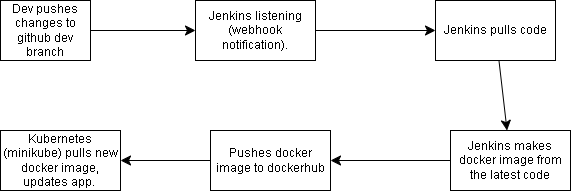

# DevOps Project – CI/CD Pipeline Implementation

- The goal of this project is to implement a CI/CD pipeline utilising AWS or Azure services for efficient software delivery. 
- The system should use:
  - Jenkins 
  - Docker
  - Kubernetes

## 

[GitHub] → [Jenkins CI/CD] → [Docker Hub]
                             ↓
                [Kubernetes on Cloud VM]
                             ↓
                     [Running Web App]



## WORKFLOW
- You write or update code and push it to GitHub.

- GitHub notifies Jenkins: “Hey, new code is here!”

**Jenkins:**

- Pulls your code

- Builds a Docker container

- Pushes it to Docker Hub

- Tells Kubernetes to deploy it

**Kubernetes:**

- Pulls the new Docker image

- Starts or updates the app

- Keeps it running and healthy


##  CI/CD Workflow

1. Developer pushes code to GitHub.
2. GitHub triggers a **webhook** to Jenkins.
3. Jenkins:
   - Pulls the latest code.
   - Builds a Docker image and tags it with a commit hash.
   - Pushes the image to Docker Hub.
   - Uses `kubectl` to update the Kubernetes deployment with the new image.
4. Kubernetes performs a rolling update.


##  Prerequisites & Setup

## Getting app online with kubernetes
- `kubectl config use-context docker-desktop` - configures your local env to use docker desktop for kubernetes host. 
- `kubectl cluster-info` - output should show "kubernetes control plane is running at ...."
- `kubectl apply -f nginx-service.yml`- tells Kubernetes to create or update the Service defined in that file.

```
kubectl apply -f nodejs-pv.yml
kubectl apply -f nodejs-pvc.yml
kubectl apply -f nodejs-mongo-deploy.yml
kubectl apply -f nginx-deploy.yml
kubectl apply -f nginx-service.yml

```

- nginx-deploy.yml - Deploys your NGINX frontend pods
- nginx-service.yml - Exposes the NGINX pods via NodePort so you can access it externally
- nodejs-mongo-deploy.yml	- Deploys both Node.js app and MongoDB pods
- nodejs-pv.yml	- Defines a Persistent Volume for MongoDB
- nodejs-pvc.yml	- Requests the Persistent Volume for MongoDB to store data.


To check if your app is running:

- `kubectl get svc` - should show nginx-svc nodeport and clusterIP. 


### Accessing the app on kubernetes - NOT NEEDED FOR THIS PROJECT - THIS SETS UP THE APP LOCALLY BUT WE WILL USE A VM WITH MINIKUBE INSTEAD - SEE LATER ON IN DOCUMENTATION (AFTER JENKINS SETUP)

- `kubectl get nodes -o wide` - displays internal-Ip that can be used to access app.
- `http://192.168.65.3:30001` - 30001 is the port specified in the service file. 
- If the url doesnt work - may be because docker desktop by default rejects or blocks nodeport externally. 

Instead:

- Forward the traffic to local host instead.
- `kubectl port-forward service/nginx-svc 30001:80`


To access the app:

- `http://localhost:30001`
- `http://127.0.0.1:30001/`


### Posts page isnt working: troubleshooting

- Go into db folder where there's a `mongo-service.yml ` file. Apply it using `kubectl apply -f mongo-service.yml`
- `kubectl get pods | grep mongo` - should show mongodb running. 


### Change the nodejs service file :

- port 30001 is already used by my nginx-svc. You can’t assign the same nodePort to two services. Change nodejs to a different port. 


```
apiVersion: v1
kind: Service
metadata:
  name: nodejs-service
spec:
  selector:
    app: nodejs
  ports:
    - protocol: TCP
      port: 3000
      targetPort: 3000
      nodePort: 30002
  type: NodePort


```
`http://127.0.0.1:30002/posts`
Should work!!

### What is Node.js doing?
Node.js runs your backend app — it handles your business logic, talks to the database (MongoDB), and serves your API like /posts.

It listens on port 3000 inside the cluster.

### What is Nginx doing?
- Nginx is acting as a web server or reverse proxy.

- It receives incoming requests from users on port 80 (the usual HTTP port).

- It then forwards those requests to your Node.js app inside the cluster.

- Nginx can also handle other stuff like caching, load balancing, or serving static files efficiently.


## Overview of using different ports for kubernetes

1. Your Node.js app runs inside a container and listens on port 3000.

2. Kubernetes gives your Node.js app a service inside the cluster so other parts (like Nginx) can talk to it using the name nodejs-service and port 3000.

3. Your Nginx container listens on port 80 and is set up to forward (proxy) requests to the Node.js service.

4. Kubernetes gives Nginx a service with a special external port called a NodePort (like 30001), which lets you access Nginx from outside the cluster.

5. So, when you visit http://your-computer-ip:30001:
the request goes to Nginx (port 80 inside its pod),

6. Nginx forwards it to Node.js (port 3000 inside its pod),

7. Node.js sends back the response through Nginx to you.

**In short:**
NodePort (30001) → Nginx (port 80) → Node.js (port 3000)

## Setting up Jenkins

- Create an ec2 instance - t2.large - Amazon Linux 2
- SSH into it (change name from ubuntu to ec2-user as its not an ubuntu ami).
  - `ssh -i ~/.ssh/aws-key-zainab.pem ec2-user@63.33.204.210`
- Install jenkins:

```
sudo yum update -y
sudo amazon-linux-extras install java-openjdk11 -y
sudo wget -O /etc/yum.repos.d/jenkins.repo https://pkg.jenkins.io/redhat-stable/jenkins.repo

sudo rpm --import https://pkg.jenkins.io/redhat-stable/jenkins.io-2023.key
sudo yum install jenkins -y

sudo systemctl start jenkins
sudo systemctl enable jenkins
```

- Jenkins needs a better version of java (17 not 11):
```


sudo rpm --import https://yum.corretto.aws/corretto.key
sudo curl -Lo /etc/yum.repos.d/corretto.repo https://yum.corretto.aws/corretto.repo

sudo yum install -y java-17-amazon-corretto-devel

sudo alternatives --install /usr/bin/java java /usr/lib/jvm/java-17-amazon-corretto/bin/java 1

sudo alternatives --config java


```

- When using `sudo alternatives --config java` - input 2 or 3 for the java option. 

```
sudo systemctl restart jenkins
sudo systemctl status jenkins

```

- Should see jenkins running. 

### Enter Jenkins

- `sudo cat /var/lib/jenkins/secrets/initialAdminPassword` to find password for jenkins. 
- Install suggested plugins. 
- When reload jenkins or login for 2nd time - jenkins may be really slow.
  - manage jenkins - system - change the jenkins url to something random that doesn't exist - it'll be faster. 


## Need to install docker on jenkins ec2 

```
sudo yum update -y
sudo amazon-linux-extras enable docker
sudo yum clean metadata
sudo yum install -y docker

```

- Check to see if docker is actually running
`systemctl status docker`
- Should show running. 

## Jenkins pipeline - 
- Install `docker pipeline` plugin. 
- Install `kubernetes CLI` plugin. 
- Install `github integration` plugin. 
- Install `SSH Agent` plugin.


### Adding credentials for docker into jenkins. 
- In dockerhub, create PAT to use for jenkins-
  - account settings - Personal access tockens - generate new token. 
  - Use the token and add it into jenkins credentials along with the docker username. 


## Setting up webhook (specify dev branch).

- In already made job - configuration
- In branches to build: 
  - `*/dev`
  - Only if dev branch exists but leave it as main for now.
- In build triggers:
  - Check the box `GitHub hook trigger for GITScm polling`

### Setting up github side webhook:

- Github- your app repo
- settings - webhooks
- Add webhook:
  - Payload Url: 
    - The jenkins server ip goes in this.
    - `http://52.31.15.176:8080/github-webhook/`
    - Disable SSL verification
    - Save.

### Jenkins with kubernetes: 


Minikube automatically creates a kubeconfig file under the current user (usually your own, like ubuntu or ec2-user). But Jenkins usually runs as a different user (like jenkins), and it won’t have access to your kubeconfig by default.

- Copy the kubeconfig to the jenkins user
  - `sudo -i` - switch to root user if needed.
  - `mkdir -p /var/lib/jenkins/.kube` - create kube directory for Jenkins.
  - `cp /home/ubuntu/.kube/config /var/lib/jenkins/.kube/config` - copy config file from your current user to jenkins. 


### Installing Git on Jenkins
- `sudo yum update -y`
- `sudo yum install git -y`
- `git --version`


## Minikube vm

- Previously set up in a kubernetes lab. 
- no space left on the vm so:
  -  `sudo du -h --max-depth=1 /var | sort -hr`
  -  Shows the contents and whats taking up storage. 
  -  Shows that the lib folder is taking the most storage so:
     -   `sudo du -h --max-depth=1 /var/lib | sort -hr`
 -  Remove docker (previously installed) - 
    -  `sudo systemctl stop docker`
    -  `sudo rm -rf /var/lib/docker`
- Remove jenkins (dont need this on the minikube vm, installed on a different vm) - 
    - `sudo rm -rf /var/lib/jenkins`
    - `sudo rm -rf /var/lib/jenkins.bak`

Space should now be available!! (`df -h`).

### Minikube set up for app

- `minikube start` 
- `kubectl apply -f sparta-app.yml` 
- Fix nginx - not running

```
sudo mkdir -p /var/log/nginx
sudo chown -R www-data:www-data /var/log/nginx
```

```
sudo nginx -t

```

```
sudo systemctl start nginx
```

```
sudo systemctl status nginx

```

- Status should show running. 

- Delete nginx and reinstall it. 
```

sudo systemctl stop nginx
 
sudo apt-get purge nginx nginx-common nginx-full
 
sudo apt-get autoremove
 
sudo rm -rf /etc/nginx
 
```

- Reinstall it

```

sudo apt install nginx
sudo nginx -t
sudo nano /etc/nginx/sites-available/default

```

`curl http://localhost` - should show successful output. 


```

        location / {
                # First attempt to serve request as file, then
                # as directory, then fall back to displaying a 404.
                proxy_pass http://192.168.58.2:30002;
        }


```

- Access the app through the vm ip :`http://<your-cloud-vm-ip>/`

Make sure:
- `kubectl get svc nodejs-service` - shows the node port- should be 30002
- Blockers - mongodb containers werent running - crashbackloop - make sure your pv and pvc are correct - the pv volume must have equal or greater capacity than pvc request to bind. 
- Check pods status - `kubectl get pods`

`http://54.154.178.148/posts` SHOULD WORK!


### Installing docker onto the jenkins vm

```
sudo apt install docker.io
sudo usermod -aG docker jenkins
sudo systemctl restart jenkins


```
### Create a Dockerfile in the jenkins vm

- `nano Dockerfile`
```
FROM node:18
WORKDIR /app
COPY . .
RUN npm install
CMD ["npm", "start"]

```

### Set up Dockerhub credentials in jenkins

In jenkins - system - credentials - add username and password.
  - dockerhub account username (zainab7861) and create a key in dockerhub for the password (dockerhub account settings, personal access tokens).


### Copy minikube vm ssh key to jenkins vm so jenkins can access it


- `scp -i /c/Users/zaina/.ssh/aws-key-zainab.pem /c/Users/zaina/.ssh/aws-key-zainab.pem ec2-user@54.74.219.27:~`
- Set the correct permissions in the jenkins vm: `chmod 600 ~/aws-key-zainab.pem`

 - Copy key from home to .ssh folder in jenkins user on jenkins vm ` sudo cp /home/ec2-user/aws-key-zainab.pem /var/lib/jenkins/.ssh/ `

 - Check if the key file successfully copied. `sudo ls -l /var/lib/jenkins/.ssh/aws-key-zainab.pem` 
 - change permissions 

```
sudo chown jenkins:jenkins /var/lib/jenkins/.ssh/aws-key-zainab.pem
sudo chmod 600 /var/lib/jenkins/.ssh/aws-key-zainab.pem

```
```
sudo systemctl status docker
sudo systemctl start docker
sudo systemctl status docker
sudo usermod -aG docker jenkins
sudo systemctl restart jenkins

```

### Add the sparta-app.yml script from minikube vm to your github so jenkins can pull it from there. 
- just create a new yml file and paste contents into it. 

### Add github credentials to jenkins

- public key on github
- private key on jenkins (add creds - ssh username with private key).


## Pipeline Script
```
pipeline {
    agent any

    environment {
        DOCKER_IMAGE = 'zainab7861/zainab-sparta-app'
        TARGET_VM = '108.130.50.28'
    }

    stages {
        stage('Checkout dev') {
            steps {
                git branch: 'dev',
                    url: 'git@github.com:zainabx78/tech501-sparta-app-cicd.git',
                    credentialsId: 'github-ssh-key'
            }
        }

        stage('Merge dev into main') {
            steps {
                sshagent(['github-ssh-key']) {
                    sh '''
                        git config user.email "jenkins@example.com"
                        git config user.name "Jenkins"
                        git checkout main
                        git pull origin main --rebase
                        git merge dev --no-ff -m "merged dev to main with jenkins"
                        git remote set-url origin git@github.com:zainabx78/tech501-sparta-app-cicd.git
                        git push origin main
                    '''
                }
            }
        }

        stage('Build Docker image') {
            steps {
                script {
                    env.IMAGE_TAG = "${DOCKER_IMAGE}:${BUILD_NUMBER}"
                    dockerImage = docker.build(env.IMAGE_TAG, 'app')
                }
            }
        }

        stage('Push to DockerHub') {
            steps {
                withCredentials([usernamePassword(credentialsId: 'docker-hub-creds', usernameVariable: 'USERNAME', passwordVariable: 'PASSWORD')]) {
                    script {
                        docker.withRegistry('https://index.docker.io/v1/', 'docker-hub-creds') {
                            dockerImage.push()
                        }
                    }
                }
            }
        }

        stage('Deploy to Minikube.') {
            steps {
                script {
                    def dockerImage = env.IMAGE_TAG

                    // Copy the K8s manifest file to the remote server
                    sh "scp -i /var/lib/jenkins/.ssh/aws-key-zainab.pem k8s/sparta-app.yml ubuntu@${TARGET_VM}:/tmp/"

                    // SSH into the remote server and apply the manifest & update the deployment image
                sh """#!/bin/bash
ssh -i /var/lib/jenkins/.ssh/aws-key-zainab.pem ubuntu@${TARGET_VM} <<EOF
kubectl apply -f /tmp/sparta-app.yml
kubectl set image deployment/nodejs-deployment nodejs-app=${dockerImage} --record
EOF
"""

                }
            }
        }
    }
}
```

## To run the pipeline:
- Make sure you change IP in the jenkins script to the new minikube IP (IP changes everytime stopped and started).
- Push change from local index file to github dev branch.
- The push triggers the pipeline - jenkins starts job. 
- Pipeline all happens and end result = change on the website. 


## BLOCKERS

1. When running pipeline - may fail due to failure of host verification when ssh at the end (from jenkins into minikube)- 
- Have to verify it by ssh into minikube vm from jenkins so it adds to trusted hosts. 
- `sudo ssh -i /var/lib/jenkins/.ssh/aws-key-zainab.pem ubuntu@108.130.50.28`

2.  When pipeline runs - in github after dev is pushed, main will be updated but might still see a message saying "main is 1 commit ahead of dev" - but the pipeline will still work and everything will work, can still ignore this message. 
3. When the pipeline runs - successful but the change isnt showing on the actual app/website - minikube out of space. 
   1. `kubectl get pods` - to see errors in pods/app running.
   2. To fix it - Login to minikube, clean up minikube images etc 
- Create a clean-up script `clean.sh`

```
#!/bin/bash
 
minikube ssh "
USAGE=\$(df -h / | tail -1 | awk '{print \$5}' | sed 's/%//')
THRESHOLD=85
echo \"Current disk usage: \${USAGE}%\"
if [ \"\$USAGE\" -ge \"\$THRESHOLD\" ]; then
  echo \"Disk usage is above or equal to \${THRESHOLD}%, running cleanup...\"
  echo \"Listing dangling volumes:\"
  docker volume ls -f dangling=true
  echo \"Running prune...\"
  docker system prune -a --volumes -f
  echo \"Cleanup complete.\"
else
  echo \"Disk usage below threshold, no cleanup needed.\"
fi
"
```
- If script not working - Same thing through manual terminal. 
  - `minikube ssh`
  - `docker volume ls -f dangling=true`
  - `docker system prune -a --volumes -f`
 