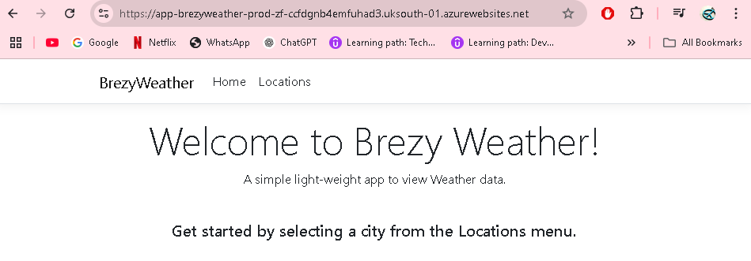
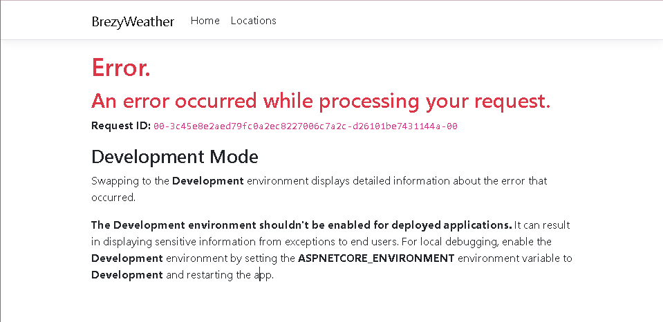

# Deploying a Containerized Web App with Azure SQL Database

1. Login to the azure portal using the credentials given. 
2. Create a SQL Database:
   - Name: `sql-brezyweather-prod-zf`
   - Create a new server with the same name, west us region. 
     - configure sql authentication:
     - username=sqladmin
     - pw=Password@123
   - Networking - public endpoint, check the box for `allow azure services and resources to access this server`. Also check the box for  `add current client IP address`. 
   - Tags: Name - zainab. 
   - Create. 
3. Create Azure App Service:
   - Name: `app-brezyweather-prod-zf`
   - Premium plan
   - Publish: Container
   - In container settings- `other container registries`, enter image and tag given- `codewithpraveen/labs-appservice-azuresql:1.0`
   - Create. 

If you copy and paste the domain for the app into a browser, should see the app page:

1. Create a connection string for the app and database. 
   - In azure app: settings on left side - environment variables - then on the top you should see connection strings. 
   - Value: `Server=tcp:sql-brezyweather-prod-zf.database.windows.net,1433;Initial Catalog=sql-brezyweather-prod-zf;Persist Security Info=False;User ID=sysadmin;Password=Password@123;MultipleActiveResultSets=False;Encrypt=True;TrustServerCertificate=False;Connection Timeout=30;` 

- Blockers:
When trying to access the `Locations` tab - recieved this error. 

- I think it's because I enabled the developer setting when creating the app instead of production. 